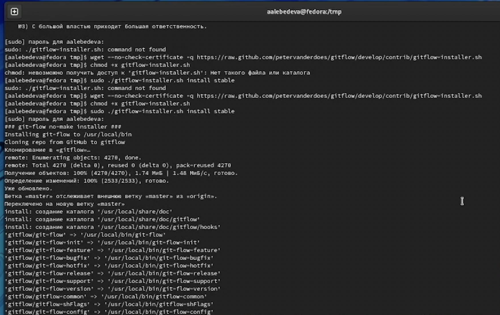
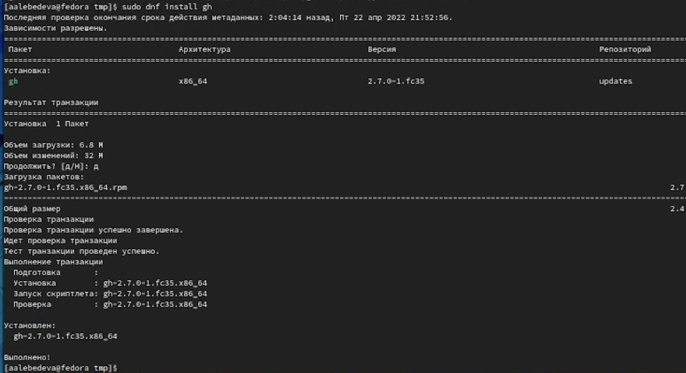
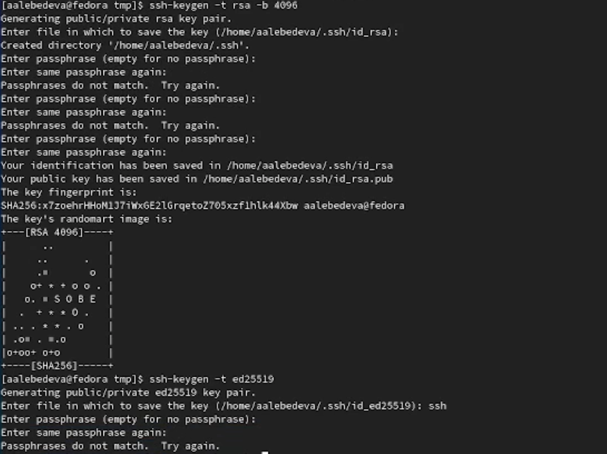
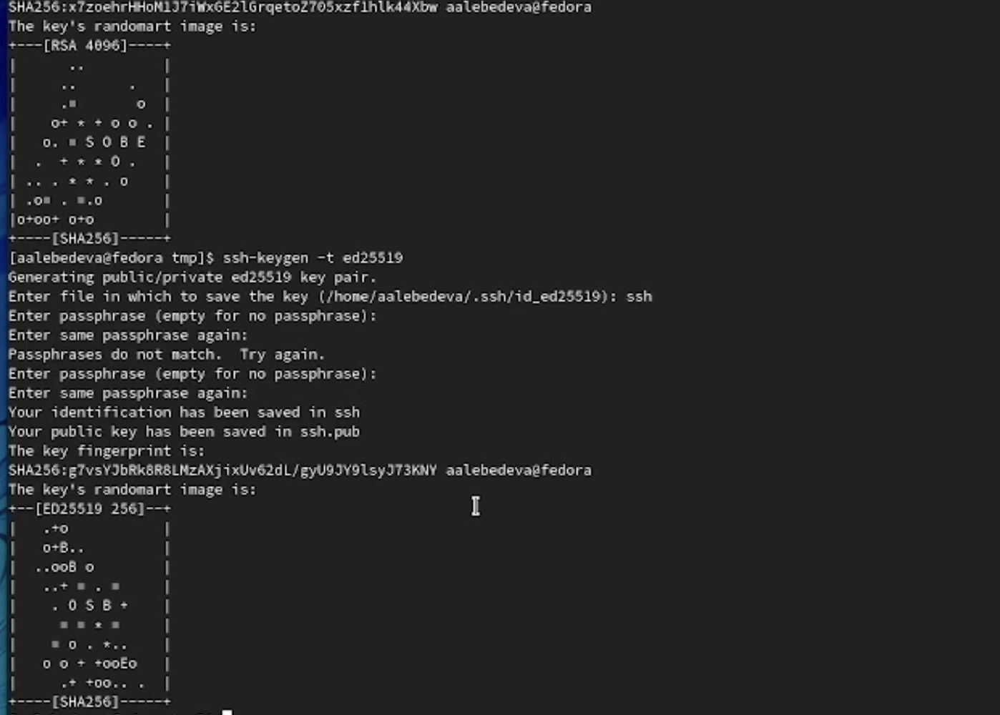
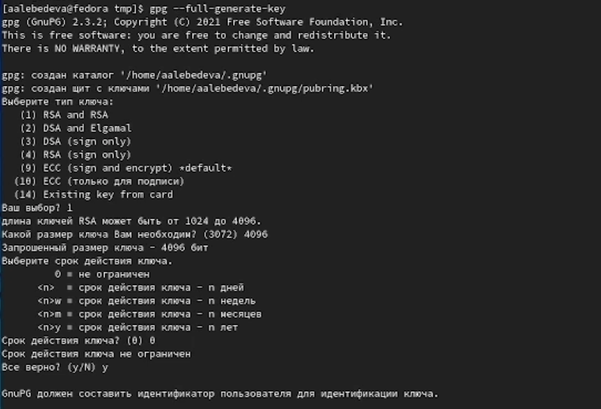
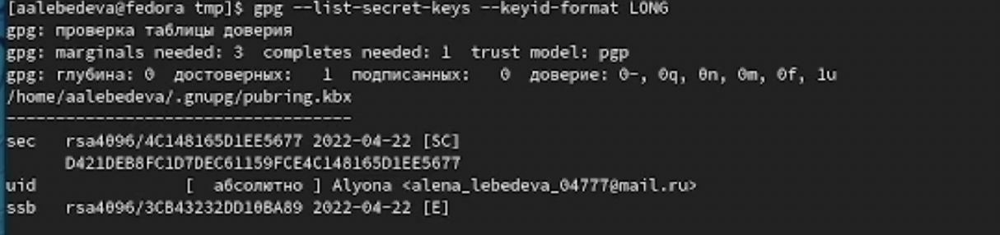
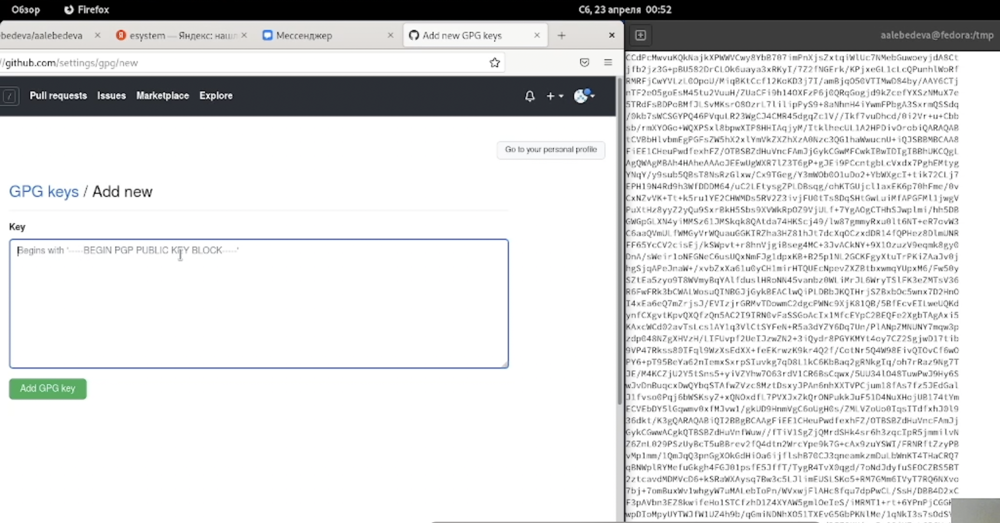
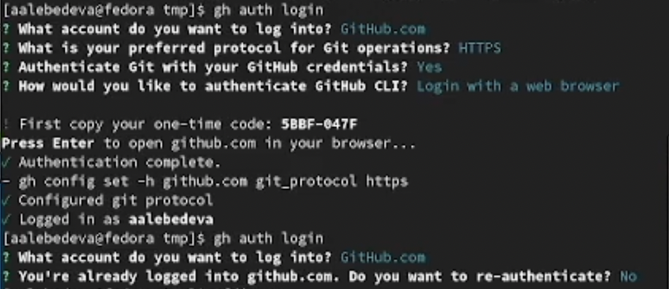
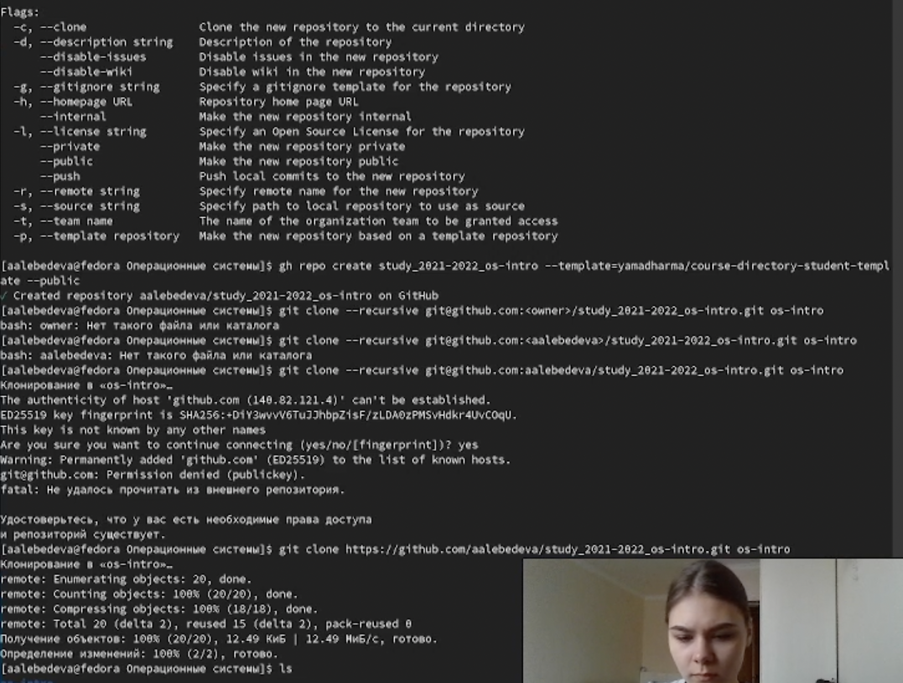
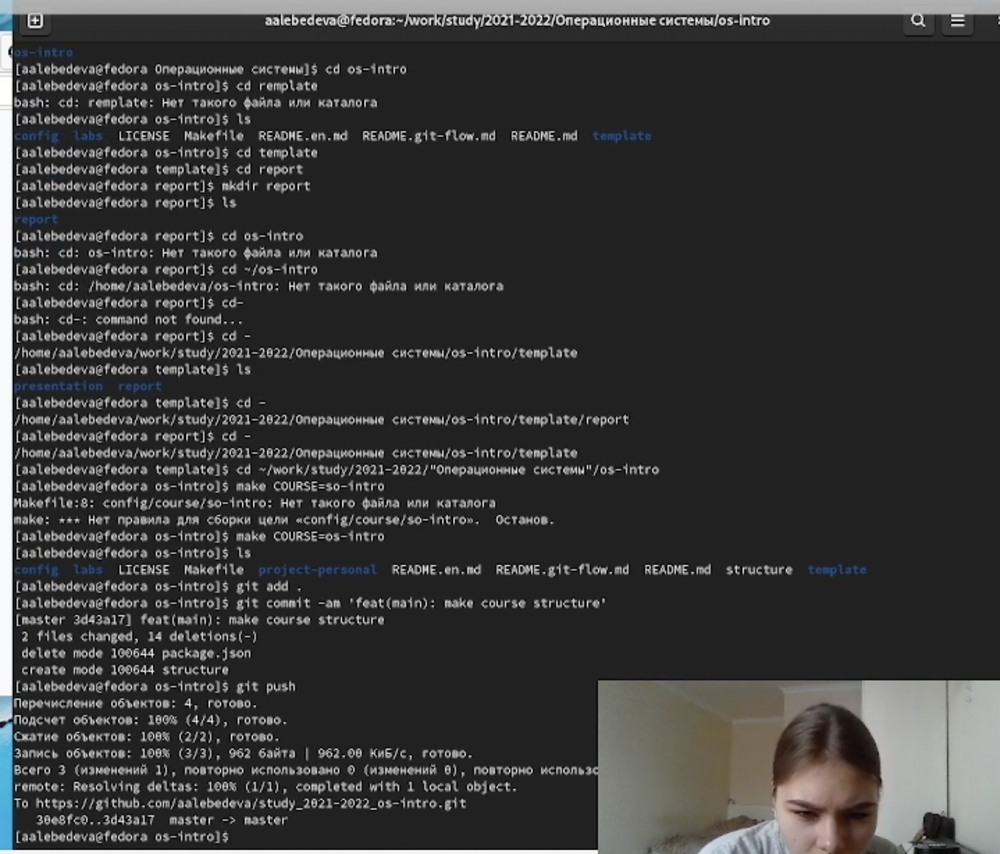

---
## Front matter
title: "Отчёт по лабораторной работе №2"
subtitle: "Дисциплина: операционные системы"
author: "Лебедева Алёна Алексеевна"

## Generic otions
lang: ru-RU
toc-title: "Содержание"

## Bibliography
bibliography: bib/cite.bib
csl: pandoc/csl/gost-r-7-0-5-2008-numeric.csl

## Pdf output format
toc: true # Table of contents
toc-depth: 2
lof: true # List of figures
lot: true # List of tables
fontsize: 12pt
linestretch: 1.5
papersize: a4
documentclass: scrreprt
## I18n polyglossia
polyglossia-lang:
  name: russian
  options:
	- spelling=modern
	- babelshorthands=true
polyglossia-otherlangs:
  name: english
## I18n babel
babel-lang: russian
babel-otherlangs: english
## Fonts
mainfont: PT Serif
romanfont: PT Serif
sansfont: PT Sans
monofont: PT Mono
mainfontoptions: Ligatures=TeX
romanfontoptions: Ligatures=TeX
sansfontoptions: Ligatures=TeX,Scale=MatchLowercase
monofontoptions: Scale=MatchLowercase,Scale=0.9
## Biblatex
biblatex: true
biblio-style: "gost-numeric"
biblatexoptions:
  - parentracker=true
  - backend=biber
  - hyperref=auto
  - language=auto
  - autolang=other*
  - citestyle=gost-numeric
## Pandoc-crossref LaTeX customization
figureTitle: "Рис."
tableTitle: "Таблица"
listingTitle: "Листинг"
lofTitle: "Список иллюстраций"
lotTitle: "Список таблиц"
lolTitle: "Листинги"
## Misc options
indent: true
header-includes:
  - \usepackage{indentfirst}
  - \usepackage{float} # keep figures where there are in the text
  - \floatplacement{figure}{H} # keep figures where there are in the text
---

# Цель работы

Изучить идеологию и применение средств контроля версий и освоить умения
по работе с git.

# Задание

 - СделайтеотчётпопредыдущейлабораторнойработевформатеMarkdown.
 - Вкачествеотчётапросьбапредоставитьотчётыв3форматах:pdf,docxиmd(вархиве, поскольку он должен содержать скриншоты, Makefile и т.д.)

# Выполнение лабораторной работы

1. Создаю учётную запись на https://github.com и заполняем основные
данные (рис. [-@fig:001])

{ #fig:001 width=70% }

2. Устанавливаем программное обеспечение git-flow в Fedora Linux.
Приходится устанавливать его вручную, так как это программное
обеспечение удалено из репозитория (рис. [-@fig:002])
{ #fig:002 width=70% }

3. Устанавливаю gh в Fedora Linux (рис. [-@fig:003])
{ #fig:003 width=70% }

4. Далее осуществляем базовую настройку git. (Зададим имя и email
владельца репозитория, Настроимutf-8ввыводесообщенийgit,
Настройте верификацию и подписание коммитов git, Зададим имя
начальной ветки (будем называть её master), параметр autocrlf,
параметр safecrlf) (рис. [-@fig:004])
{ #fig:004 width=70% }
(рис. [-@fig:005])
{ #fig:005 width=70% }

5. Создаём ключи ssh по алгоритму rsa с ключом размером 4096 бит и по
алгоритму ed25519 (рис. [-@fig:006])
{ #fig:006 width=70% }
(рис. [-@fig:007])
{ #fig:007 width=70% }

6. Создаём ключи pgp
 - Генерируем ключ
 - Выбираем нужные нам опции
 - Далее gpg запросит личную информацию, которая сохраница в ключе. Надо её предоставить. (рис. [-@fig:008])
{ #fig:008 width=70% }

7. Добавление PGP ключа в GitHub
 - Выводим список ключей и копируем отпечаток приватного ключа (рис. [-@fig:009])
{ #fig:009 width=70% }
 - Копируем наш сгенерированный PGP ключ в буфер обмена
 - Переходим в настройки GitHub (https://github.com/settings/keys), нажимаем кнопку New GPG key и вставляем полученный ключ в
поле ввода (рис. [-@fig:010])
{ #fig:010 width=70% }

8. Настраиваем автоматические подписи коммитов git

9. Настраиваем gh
 - Авторизовываемся (рис. [-@fig:011])
{ #fig:011 width=70% }

10. Создаём репозиторий курса на основе шаблона. Создаём шаблон рабочего пространства (рис. [-@fig:012])
{ #fig:012 width=70% }

11. Настраиваем каталог
 - Переходим в каталог курса и удаляем лишние файлы
 - Создаём необходимые каталоги
 - Отправляем файлы на сервер
(рис. [-@fig:013])
{ #fig:013 width=70% }

# Выводы

Изучила идеологию и применение средств контроля версий и освоила умения
по работе с git.

