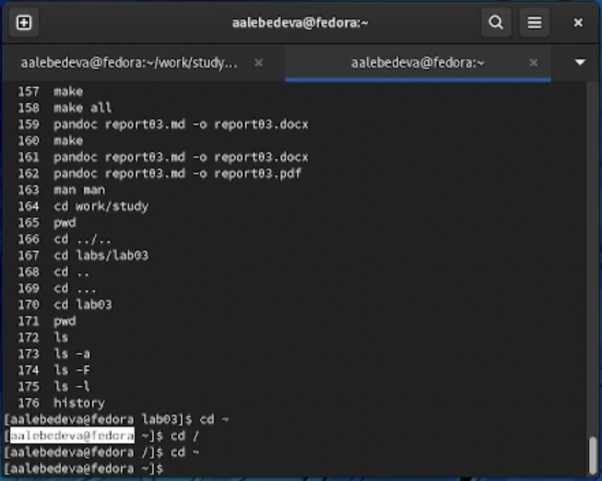
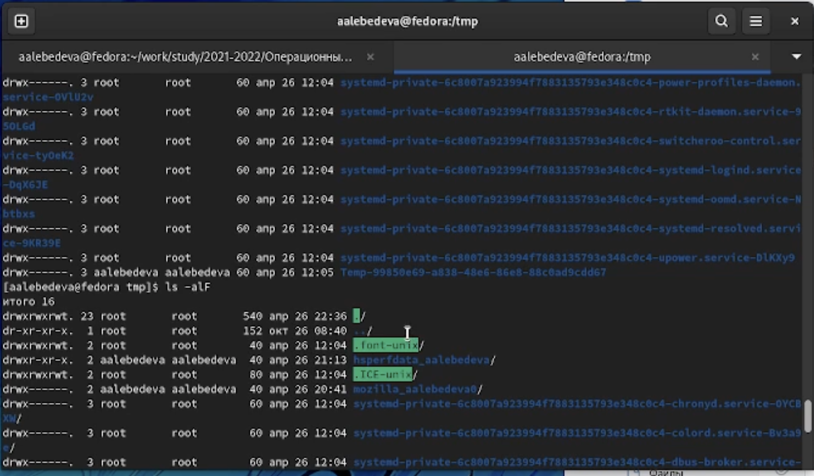
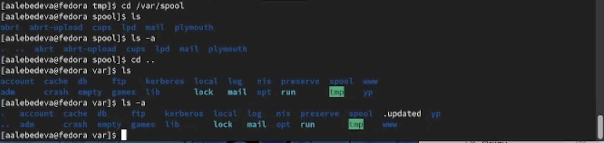
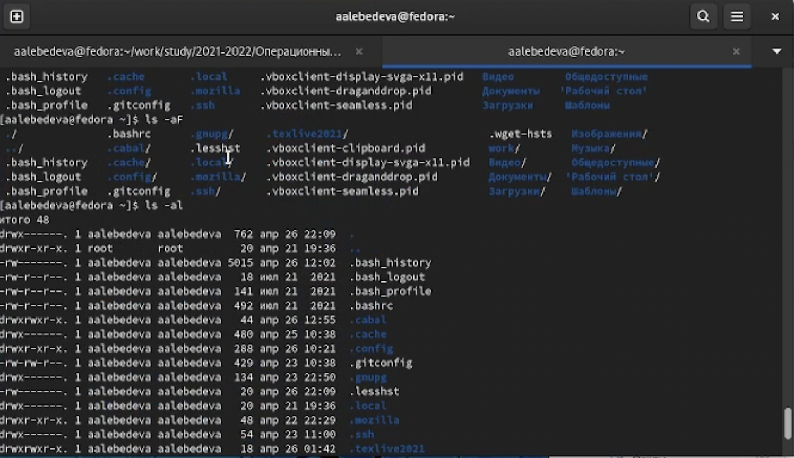
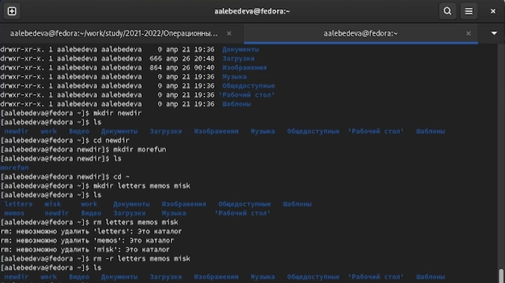
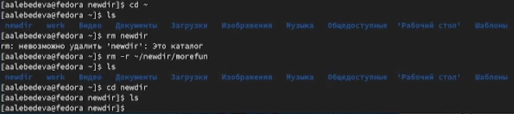
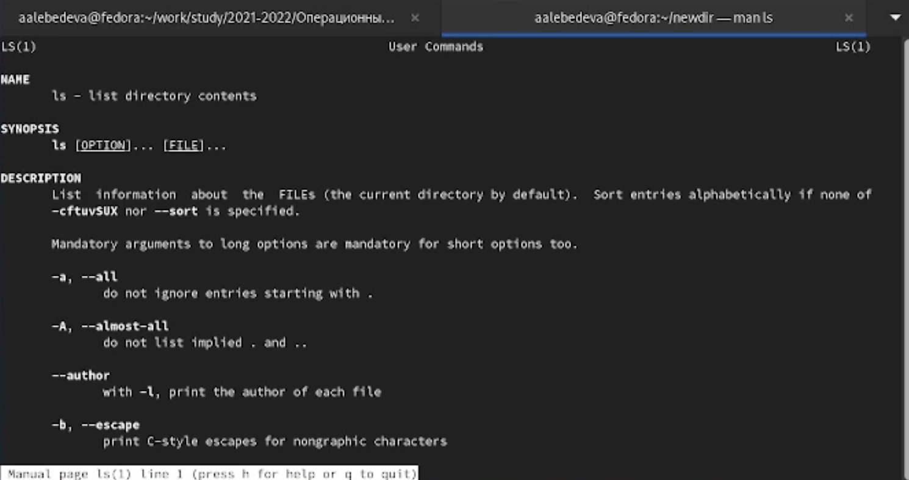
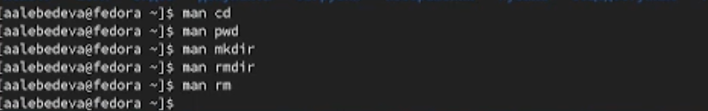
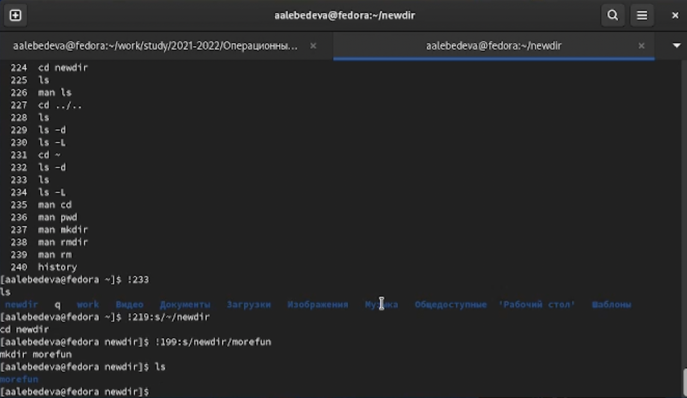

---
## Front matter
lang: ru-RU
title: "Отчёт по лабораторной работе №3"
author: "Лебедева Алёна Алексеевна"
institute: |
	"Российский Университет Дружбы Народов"
date: "26 апреля 2022"

## Formatting
toc: false
slide_level: 2
theme: metropolis
header-includes: 
 - \metroset{progressbar=frametitle,sectionpage=progressbar,numbering=fraction}
 - '\makeatletter'
 - '\beamer@ignorenonframefalse'
 - '\makeatother'
aspectratio: 43
section-titles: true
---

# Цель работы

Приобретение практических навыков взаимодействия пользователя с системой посредством командной строки

## 1

Определина полное имя домашнего каталога 
 (рис. [-@fig:001])

{ #fig:001 width=70% }

## 2

Перешла в каталог /tmp.
   Вывела на экран содержимое каталога /tmp спомощью команды ls -slF, пояснила разницу между разными опциями
   (рис. [-@fig:002])

{ #fig:002 width=70% }

## 3

Определила, что в каталоге /var/spool нет подкаталог с именем cron
(рис. [-@fig:003])

{ #fig:003 width=70% }

## 4

Перешла в домашний каталог и вывела на экран его содержимое. Определила владельца файлов и каталогов
(рис. [-@fig:004])

{ #fig:004 width=70% }

## 5

В домашнем каталоге создаю новый каталог с именем newdir.
   В каталоге ~/newdir создаю новый каталог с именем morefun.
   В домашнем каталоге создаю одной командойтри новые каталоги с именами
letters,memos,misk.Затем удаляю эти каталоги одной командой.
(рис. [-@fig:005])

{ #fig:005 width=70% }

## 6

Пробую удалить ранее созданный каталог ~/newdir командой rm, но он не удалился
   Удаляю каталог ~/newdir/morefun из домашнего каталога
   (рис. [-@fig:006])

{ #fig:006 width=70% }

## 7

С помощью команды man определяю, какую опцию команды ls нужно использовать для просмотра содержимое не только указанного каталога, но и подкаталогов, входящих в него. Также определяю набор опций команды ls, позволяющий отсортировать по времени последнего изменения выводимый список содержимого каталога с развёрнутым описанием файлов
 (рис. [-@fig:007])

{ #fig:007 width=70% }

## 8

с помощью команды man определяю основные опции следующих команд: cd,pwd,mkdir,
rmdir,rm.
(рис. [-@fig:008])

{ #fig:008 width=70% }

## 9

При помощи команды history смотрю историю команд, далее выполняю модификацию и исполнение нескольких команд из буфера команд
(рис. [-@fig:009])

{ #fig:009 width=70% }

# Вывод

В ходе выполнения лабораторной работы я приобрела практические навыки взаимодействия пользователя с системой посредством командной строки

