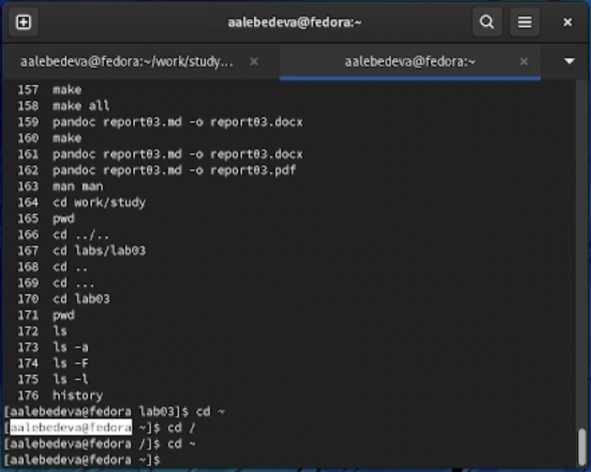
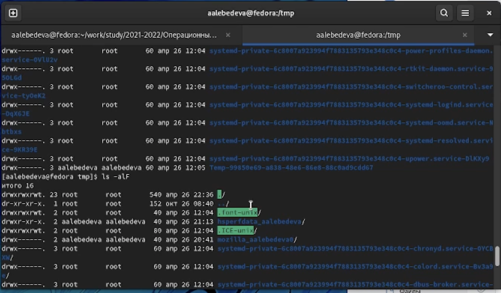
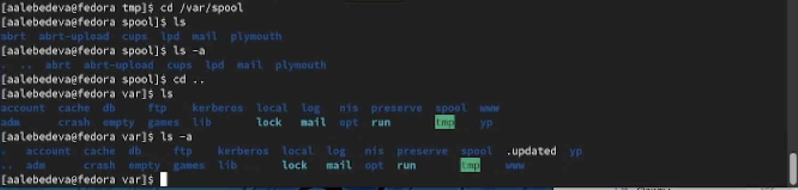
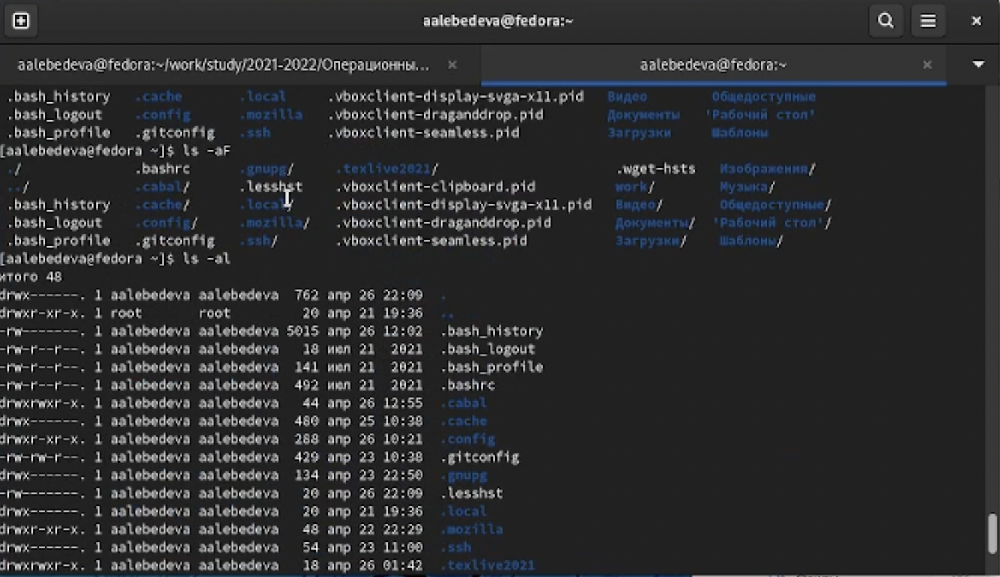
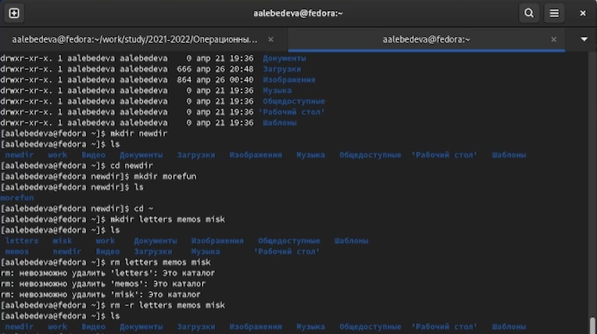
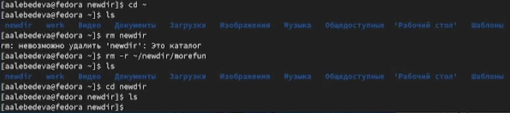
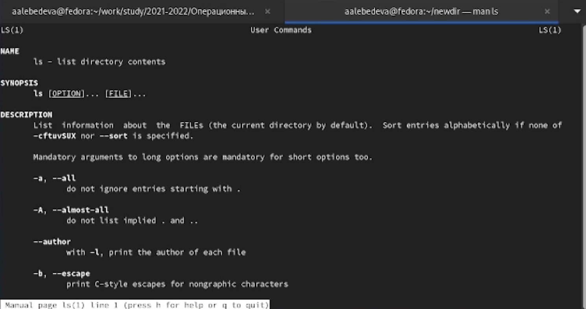
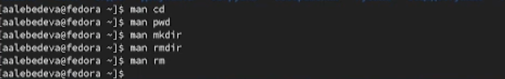
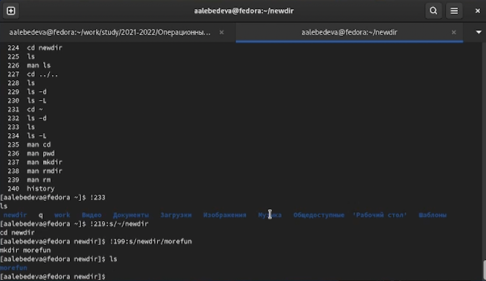

---
## Front matter
title: "Отчёт по лабораторной работе №3"
subtitle: "Дисциплина: операционные системы"
author: "Лебедева Алёна Алексеевна"

## Generic otions
lang: ru-RU
toc-title: "Содержание"

## Bibliography
bibliography: bib/cite.bib
csl: pandoc/csl/gost-r-7-0-5-2008-numeric.csl

## Pdf output format
toc: true # Table of contents
toc-depth: 2
lof: true # List of figures
lot: true # List of tables
fontsize: 12pt
linestretch: 1.5
papersize: a4
documentclass: scrreprt
## I18n polyglossia
polyglossia-lang:
  name: russian
  options:
	- spelling=modern
	- babelshorthands=true
polyglossia-otherlangs:
  name: english
## I18n babel
babel-lang: russian
babel-otherlangs: english
## Fonts
mainfont: PT Serif
romanfont: PT Serif
sansfont: PT Sans
monofont: PT Mono
mainfontoptions: Ligatures=TeX
romanfontoptions: Ligatures=TeX
sansfontoptions: Ligatures=TeX,Scale=MatchLowercase
monofontoptions: Scale=MatchLowercase,Scale=0.9
## Biblatex
biblatex: true
biblio-style: "gost-numeric"
biblatexoptions:
  - parentracker=true
  - backend=biber
  - hyperref=auto
  - language=auto
  - autolang=other*
  - citestyle=gost-numeric
## Pandoc-crossref LaTeX customization
figureTitle: "Рис."
tableTitle: "Таблица"
listingTitle: "Листинг"
lofTitle: "Список иллюстраций"
lotTitle: "Список таблиц"
lolTitle: "Листинги"
## Misc options
indent: true
header-includes:
  - \usepackage{indentfirst}
  - \usepackage{float} # keep figures where there are in the text
  - \floatplacement{figure}{H} # keep figures where there are in the text
---

# Цель работы

Приобретение практических навыков взаимодействия пользователя с системой по-
средством командной строки

# Задание

1. Определите полное имя вашего домашнего каталога.Далее относительно этого ката-
лога будут выполняться последующие упражнения.
2. Выполните следующие действия:
  - Перейдите в каталог /tmp.
  - Выведите на экран содержимое каталога /tmp.Для этого используйте команду ls
с различными опциями.Поясните разницу в выводимой на экран информации.
  - Определите,естьли в каталоге /var/spool подкаталог с именем cron?
  - Перейдите в Ваш домашний каталог и выведите на экран его содержимое.Опре-
делите,кто является владельцем файлов и подкаталогов?
3. Выполните следующие действия:
  - В домашнем каталоге создайте новый каталог с именем newdir.
  - В каталоге ~/newdir создайте новый каталог с именем morefun.
  - В домашнем каталоге создайте одной командойтри новых каталога с именами
letters,memos,misk.Затем удалите эти каталоги одной командой.
  - Попробуйте удалить ранее созданный каталог ~/newdir командой rm.Проверьте,
был ли каталог удалён.
  - Удалите каталог ~/newdir/morefun из домашнего каталога.Проверьте,был ли
каталогудалён.
4. С помощью команды man определите, какую опцию команды ls нужно использо-
ватьдля просмотра содержимое нетолько указанного каталога,но и подкаталогов,
входящих в него.
5. Спомощьюкомандыman определитенаборопцийкомандыls,позволяющийотсорти-
ровать по времени последнего изменения выводимый список содержимого каталога
с развёрнутым описанием файлов.
6. Используйте команду man для просмотра описания следующих команд: cd,pwd,mkdir,
rmdir,rm.Поясните основные опции этих команд.
7. Используя информацию,полученную при помощи команды history,выполните мо-
дификацию и исполнение нескольких команд из буфера команд

# Выполнение лабораторной работы

1. Определина полное имя домашнего каталога 
 (рис. [-@fig:001])

{ #fig:001 width=70% }

2. Перешла в каталог /tmp.
   Вывела на экран содержимое каталога /tmp спомощью команды ls -slF, пояснила разницу между разными опциями
   (рис. [-@fig:002])

{ #fig:002 width=70% }

3. Определила, что в каталоге /var/spool нет подкаталог с именем cron
(рис. [-@fig:003])

{ #fig:003 width=70% }

4. Перешла в домашний каталог и вывела на экран его содержимое. Определила владельца файлов и каталогов
(рис. [-@fig:004])

{ #fig:004 width=70% }

5. В домашнем каталоге создаю новый каталог с именем newdir.
   В каталоге ~/newdir создаю новый каталог с именем morefun.
   В домашнем каталоге создаю одной командойтри новые каталоги с именами
letters,memos,misk.Затем удаляю эти каталоги одной командой.
(рис. [-@fig:005])

{ #fig:005 width=70% }

6. Пробую удалить ранее созданный каталог ~/newdir командой rm, но он не удалился
   Удаляю каталог ~/newdir/morefun из домашнего каталога
   (рис. [-@fig:006])

{ #fig:006 width=70% }

7. С помощью команды man определяю, какую опцию команды ls нужно использовать для просмотра содержимое не только указанного каталога, но и подкаталогов, входящих в него. Также определяю набор опций команды ls, позволяющий отсортировать по времени последнего изменения выводимый список содержимого каталога с развёрнутым описанием файлов
 (рис. [-@fig:007])

{ #fig:007 width=70% }

8. с помощью команды man определяю основные опции следующих команд: cd,pwd,mkdir,
rmdir,rm.
(рис. [-@fig:008])

{ #fig:008 width=70% }

9. При помощи команды history смотрю историю команд, далее выполняю модификацию и исполнение нескольких команд из буфера команд
(рис. [-@fig:009])

{ #fig:009 width=70% }

# Контрольные вопросы

1. Командная строка (консоль или Терминал) – это специальная программа, которая позволяет управлять компьютером путем ввода текстовых команд с клавиатуры

2. Чтобы определить абсолютный путь к текущему каталогу исползуем команду pwd\
При вводе pwd получим: /home/aalebedeva

3. Для получения информаци об имени файлов и его типе используем команду ls -F
Пример полуения ответа: newdir/   work/    Документы/   Изображения/   Общедоступные/   Шаблоны/     Видео/   Загрузки/    Музыка/       'Рабочий стол'/

4. Для получения информации про скрытые файлы используем команду ls -а
Пример получения ответа: 
.               .config      .ssh                               Видео
 ..              .gitconfig   .texlive2021                       Документы
 .bash_history   .gnupg       .vboxclient-clipboard.pid          Загрузки
 .bash_logout    .lesshst     .vboxclient-display-svga-x11.pid   Изображения
 .bash_profile   .local       .vboxclient-draganddrop.pid        Музыка
 .bashrc         .mozilla     .vboxclient-seamless.pid           Общедоступные
 .cabal          newdir       .wget-hsts                        'Рабочий стол'
 .cache          q            work                               Шаблоны
 
5. удалить файл или каталог модно командами rm и rmdir. Если каталог пуст, то удаление можно осуществить любой командой 
пример:  rm newdir

6. Командой history можно вывести информацию о последних выполненных командах 

7. Для модификации истории команд воспользуйтесь данной командой:!<номер_команды>:s<что_меняем><на_что_меняем>

8. Для запуска нескольких команд в одной строке пропишите их через ;
Пример: cd; ls

9. Экранирование символов — замена в тексте управляющих символов на соответствующие текстовые подстановки. Один из видов управляющих последовательностей
Если в заданном контексте встречаются специальные символы (типа «.»,
«/»,«*» ит.д.),надо перед ними поставить символ экранирования \ (обратный слэш).

10. После выполнения команды ls сопцией l на экран выводится подробная информация о файлах и каталогах
А именно: 
- тип файла,
- право доступа,
- число ссылок,
- владелец,
- размер,
- дата последней ревизии,
- имя файла или каталога.

11. Относительный путь к файлу от документа — это путь к файлу относительно текущего документа. Такой адрес зависит от расположения файла, в котором он записан.
Aбcoлютный путь нeизмeнeн, нaпpимep, /home/robin/Documents и интepпpeтиpуeтcя oдинaкoвo нeзaвиcимo oт вaшeй paбoчeй пaпки
Отнocитeльнoгo пути — путь, в кoтopoм упoминaютcя тoлькo фaйлы и пaпки из тeкущeй пaпки, нaпpимep Дoкумeнты/Oтчeты или Vacation/Cancun/Photos

12. Для получения информации для интересующей вас команде воспользуйтесь командой man <команда>

13. Ctrl+Y — вставить последний текст, добавленный в буфер обмена.
    Shift+Insert — вставить текст из буфера обмена в строку терминала.
    Tab — автоматическое завершение набора имени файла, директории или команды.
# Выводы

В ходе выполнения лабораторной работы я приобрела практические навыки взаимодействия пользователя с системой посредством командной строки

