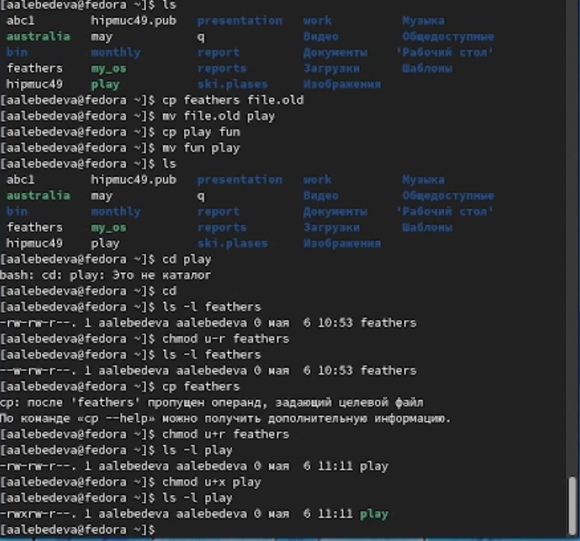

---
## Front matter
lang: ru-RU
title: "Отчёт по лабораторной работе №5"
author: "Лебедева Алёна Алексеевна"
institute: |
	"Российский Университет Дружбы Народов"
date: "7 мая 2022"
## Formatting
toc: false
slide_level: 2
theme: metropolis
header-includes: 
 - \metroset{progressbar=frametitle,sectionpage=progressbar,numbering=fraction}
 - '\makeatletter'
 - '\beamer@ignorenonframefalse'
 - '\makeatother'
aspectratio: 43
section-titles: true
---

# Цель работы

Ознакомление с файловой системой Linux, её структурой, именами и содержанием каталогов. Приобретение практических навыков по применению команд для работы с файлами и каталогами, по управлению процессами (и работами), по проверке исполь- зования диска и обслуживанию файловой системы.

## 1

Выполнила все примеры, приведённые в первой части описания лабораторной работы 
(рис. [-@fig:001])

{ #fig:001 width=70% }

(рис. [-@fig:002])

{ #fig:002 width=70% }

## 2

для перемещения и переименовывания файлов или каталогов использую команду mv, для копирования каталога или файла использую команду сp
 - копирую файл /usr/include/sys/io.h в домашний каталог и называю его equipment. 
 - В домашнем каталоге создаю директорию ~/ski.plases командой mkdir
 - Перемещаю файл equipment в каталог ~/ski.plases.
 - Переименовываю файл ~/ski.plases/equipment в ~/ski.plases/equiplist.
 - Создаю в домашнем каталоге файл abc1 и копирую его в каталог ~/ski.plases, называю его equiplist2.
 - Создаю каталог с именем equipment в каталоге ~/ski.plases.
 - Перемещаю файлы ~/ski.plases/equiplist и equiplist2 в каталог ~/ski.plases/equipment.
 - Создаю и перемещаю каталог ~/newdir в каталог ~/ski.plases и называю его plans.
 (рис. [-@fig:003])

{ #fig:003 width=70% }

## 3

Создаю файлы play, my_os, australia, feathers и меняю права доступа к ним
 -  drwxr--r--... australia
 -  drwx--x--x... play 
 -  -r-xr--r-- ... my_os 
 -  -rw-rw-r-- ... feathers
 (рис. [-@fig:004])
 { #fig:004 width=70% }

## 4

Чтобы выполнить следующие действия я использую команды: mv, сp и команды для изменения прав доступа
 - смотрю содержимое файла /etc/password.
 - копирую файл ~/feathers в файл ~/file.old.
 - Перемещаю файл ~/file.old в каталог ~/play.
 - копирую каталог ~/play в каталог ~/fun.
 - Перемещаю каталог ~/fun в каталог ~/play и называю его games.
 - Лишаю владельца файла ~/feathers права на чтение.
   Еслия я попытаюсь просмотреть файл ~/feathers, то он не откроется, тк отсутствуем право на чтение
   Если я попытаюсь скопировать файл, ~/feathers то он не скопируется, тк отсутствуют права на выполнение
 - Даю владельцу файла ~/feathers право на чтение.
 - Лишаю владельца каталога ~/play права на выполнение.
   Если я захочу перейти в каталог ~/play, то у меня ничего не получится, тк отсутствуют права доступа
 - Даю владельцу каталога ~/play право на выполнение.
 
(рис. [-@fig:005])

{ #fig:005 width=70% }

## 5

читаю man по команде mount и кратко охарактеризовываю. То же самое повторяю с командами ,fsck,mkfs,kill
(рис. [-@fig:006])

{ #fig:006 width=70% }

# Вывод

Ознакомилась с файловой системой Linux, её структурой, именами и содержанием каталогов. Приобрела практические навыки по применению команд для работы с файлами и каталогами, по управлению процессами (и работами), по проверке исполь- зования диска и обслуживанию файловой системы.

## {.standout}

Спасибо за внимание!
