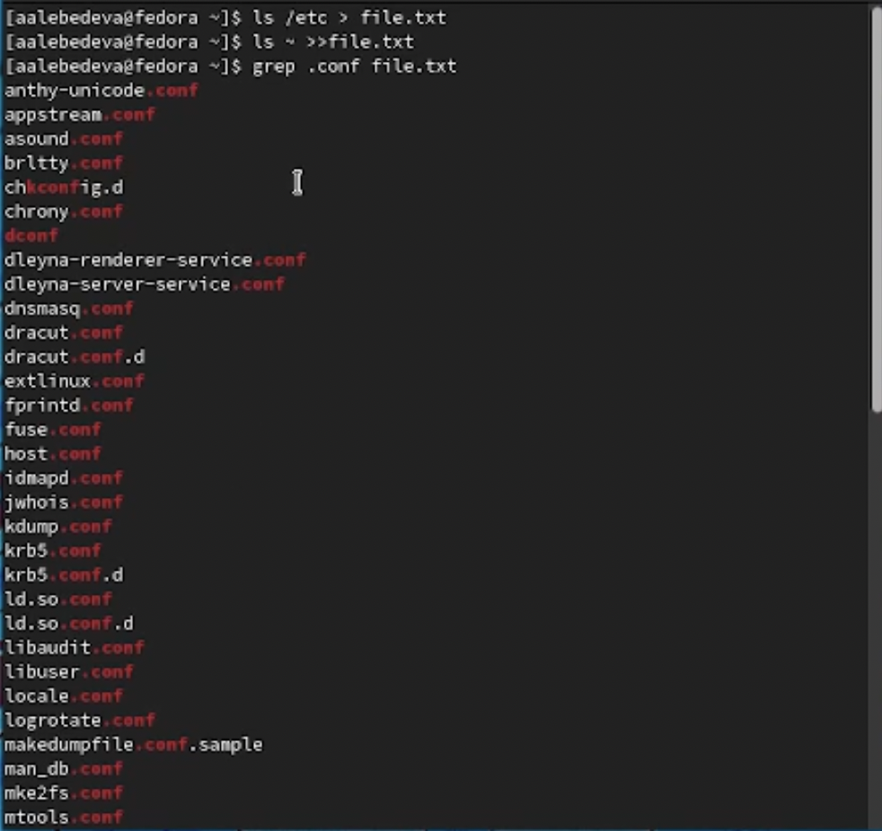
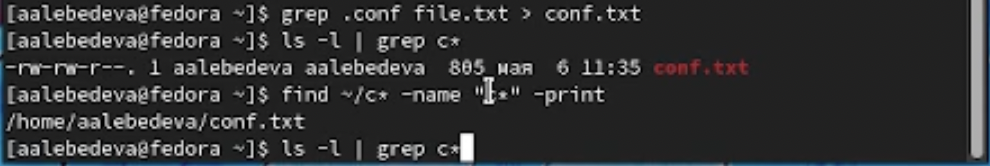
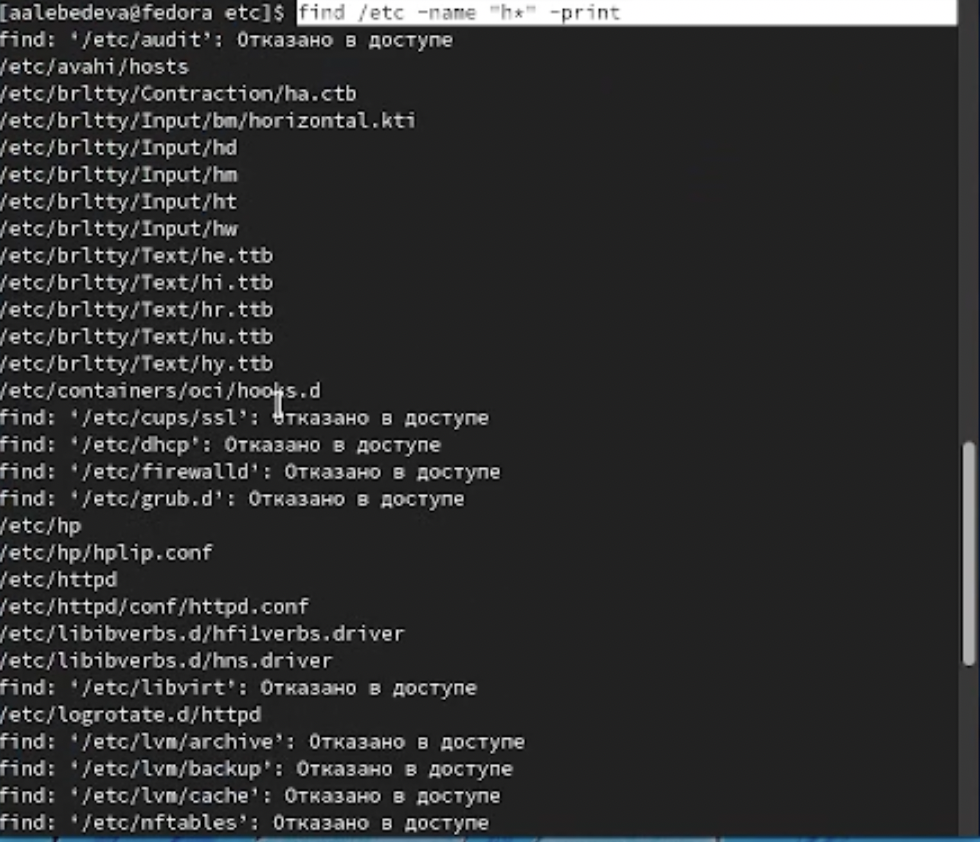
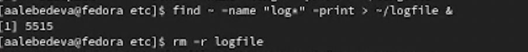
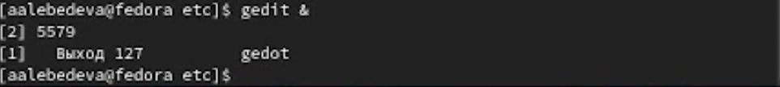
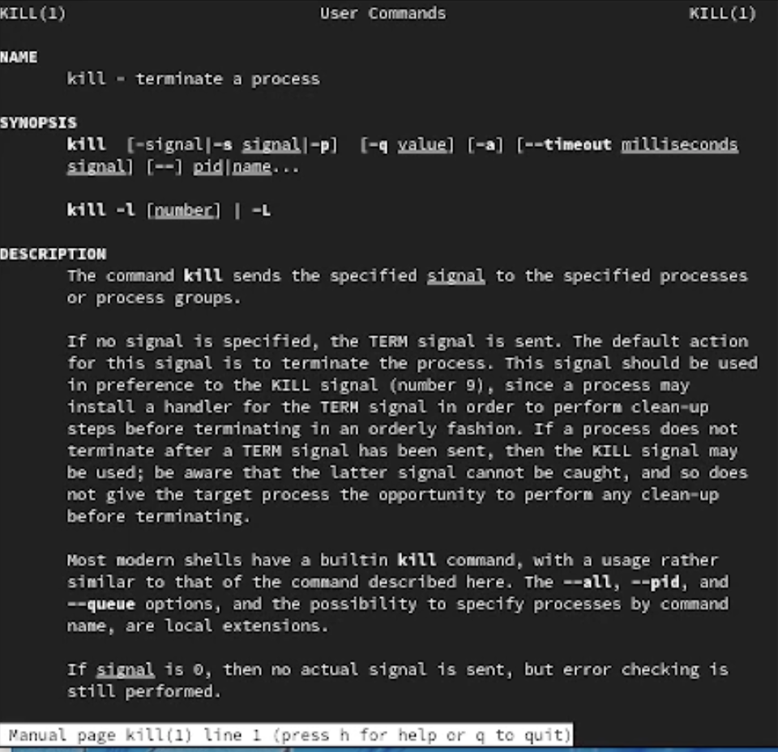
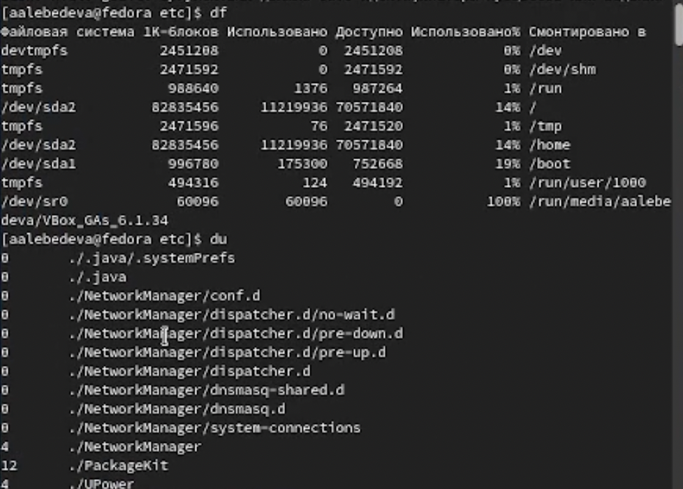
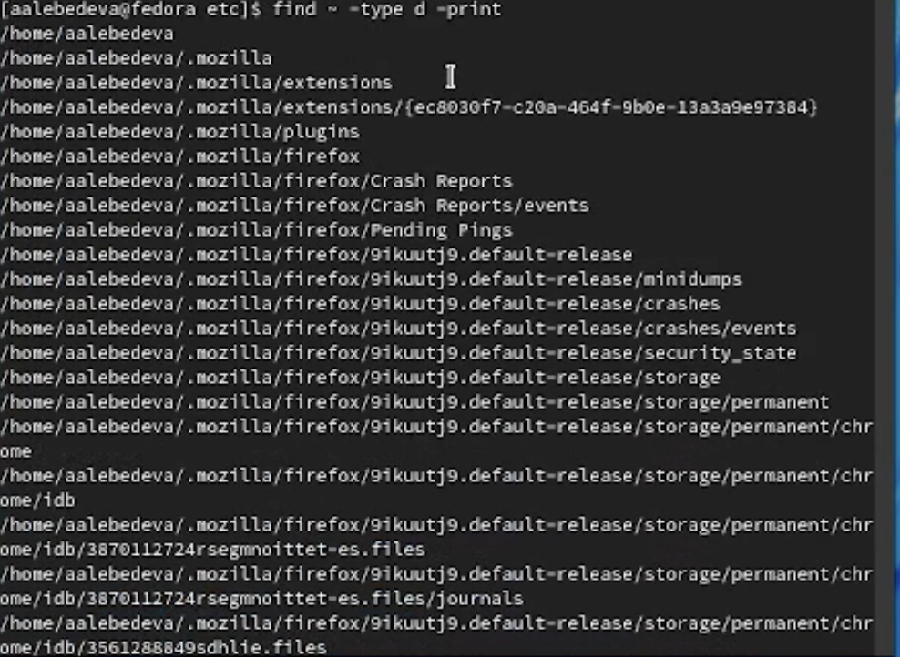

---
## Front matter
lang: ru-RU
title: "Отчёт по лабораторной работе №6"
author: "Лебедева Алёна Алексеевна"
institute: |
	"Российский Университет Дружбы Народов"
date: "7 мая 2022"

## Formatting
toc: false
slide_level: 2
theme: metropolis
header-includes: 
 - \metroset{progressbar=frametitle,sectionpage=progressbar,numbering=fraction}
 - '\makeatletter'
 - '\beamer@ignorenonframefalse'
 - '\makeatother'
aspectratio: 43
section-titles: true
---

# Цель работы

Ознакомление с инструментами поиска файлов и фильтрации текстовых данных. Приобретение практических навыков: по управлению процессами (и заданиями), по проверке использования диска и обслуживанию файловых систем.

## 1

 Захожу в систему с помощью логина и пароля

## 2

Для того, чтобы записать в файл file.txt названия файлов, содержащихся в каталоге /etc, использую команду «ls /etc > file.txt». Далее с помощью команды «ls ~ >> file.txt» дописываю в этот же файл названия файлов, содержащихся в моем домашнем каталоге. 

Вывожу имена всех файлов из file.txt, имеющих расширение .conf и записываю их в новый текстовой файл conf.txt с помощью команды «grep .conf file.txt 
(рис. [-@fig:001])

{ #fig:001 width=70% }

## 3

Чтобы вывести на экран файлы, имена которых начинаются с символа с, я использую команды ls -l |grep c*; find ~/c* -name "c*" -print

(рис. [-@fig:002])

{ #fig:002 width=70% }

## 4

Чтобы вывести на экран (постранично) имена файлов из каталога /etc, начинающиеся с символа h, воспользуемся командой «find /etc –name “h*” -print» 

(рис. [-@fig:003])

{ #fig:003 width=70% }

## 5

Запускаю в фоновом режиме процесс, который будет записывать в файл ~/logfile файлы, имена которых начинаются с log, используя команду «find ~ -name “log*” -print > ~/logfile &» 
Удаляю файл ~/logfile командой «rm logfile»

(рис. [-@fig:004])

{ #fig:004 width=70% }

## 6

Запускаю из консоли в фоновом режиме редактор gedit.

(рис. [-@fig:005])

{ #fig:005 width=70% }

## 7

Чтобы определить идентификатор процесса gedit, использую команду «ps | grep -i “gedit”». Наш процесс имеет PID 518. Узнать идентификатор процесса можно также, используя команду «pgrep gedit» или «pidof gedit»

## 8

Прочитав информацию о команде kill с помощью команды «man kill», использую её для завершения процесса gedit

(рис. [-@fig:006])

{ #fig:006 width=70% }

## 9

Выполните команды df и du, предварительно получив более подробную информацию
об этих командах, с помощью команды man.

(рис. [-@fig:007])

{ #fig:007 width=70% }

## 10

Получаем информацию с помощью команды «man find» и выводим имена всех директорий, имеющихся в домашнем каталоге с помощью команды «find ~ -type d -print» 

(рис. [-@fig:008])

{ #fig:008 width=70% }

# Вывод

Ознакомилась с инструментами поиска файлов и фильтрации текстовых данных. Приобрела практические навыки: по управлению процессами (и заданиями), по проверке использования диска и обслуживанию файловых систем.

## {.standout}

Спасибо за внимание!
