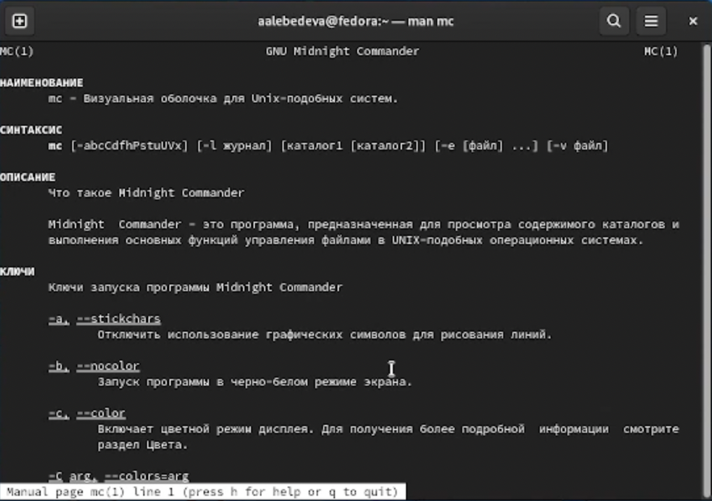
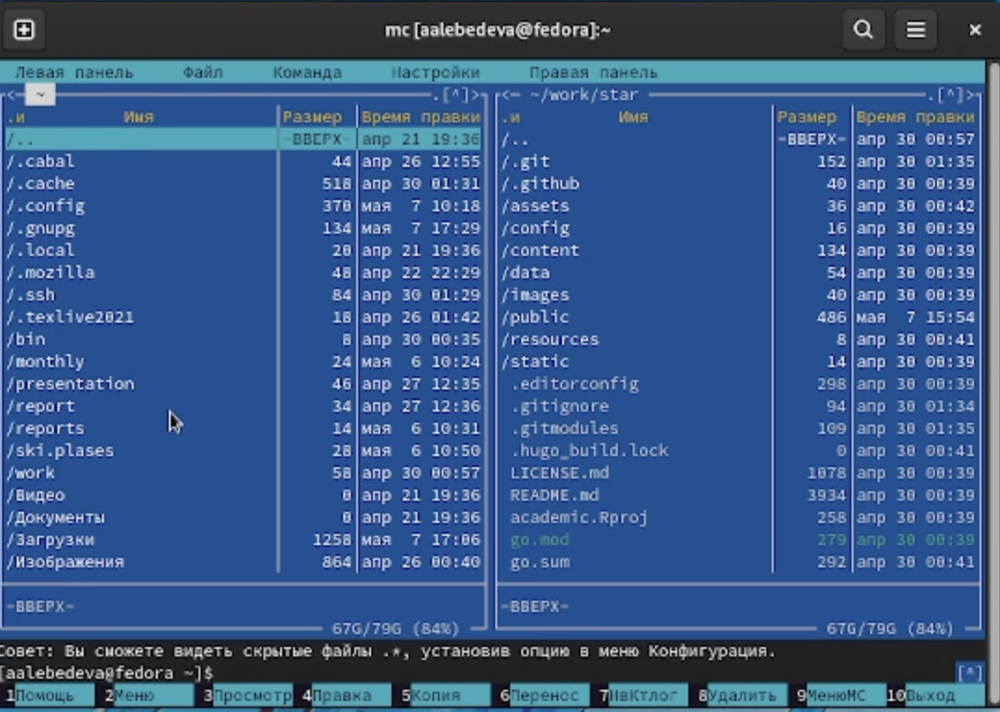
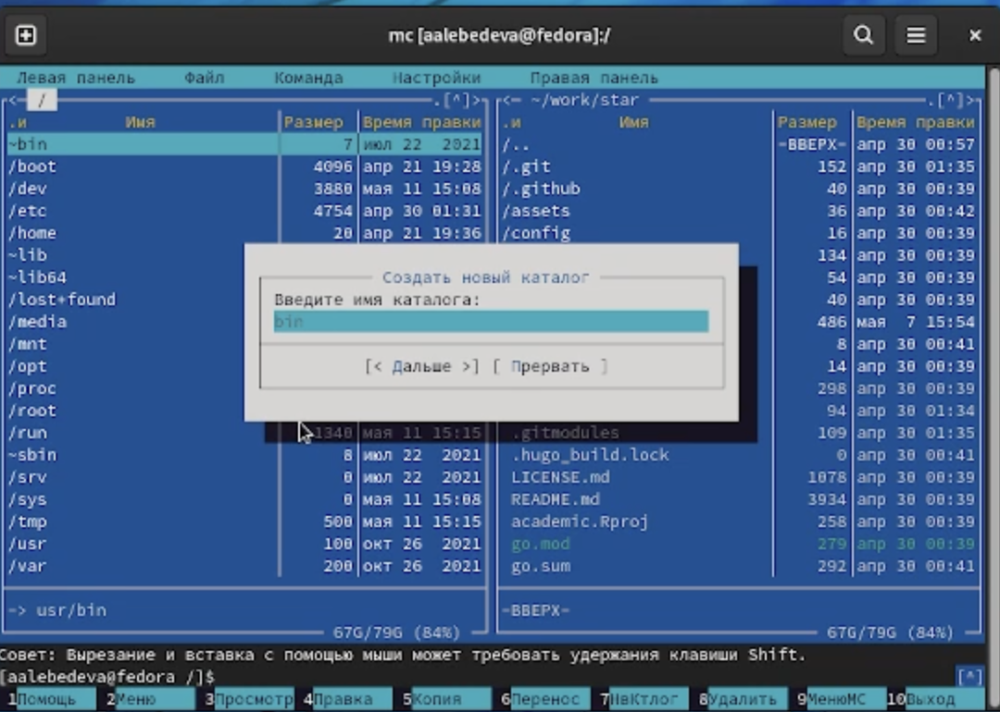
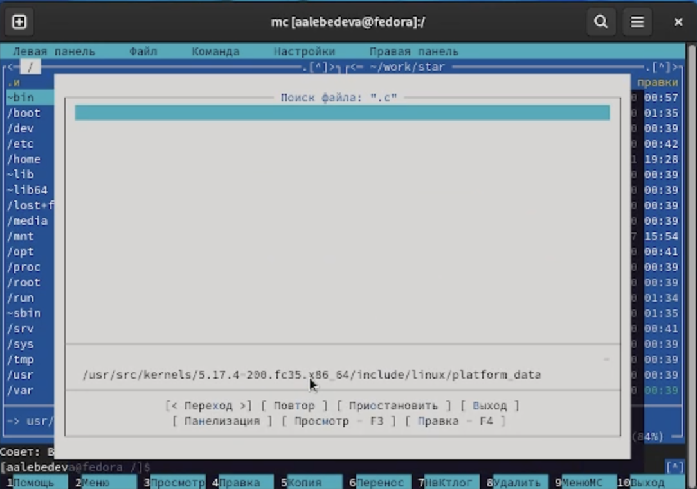
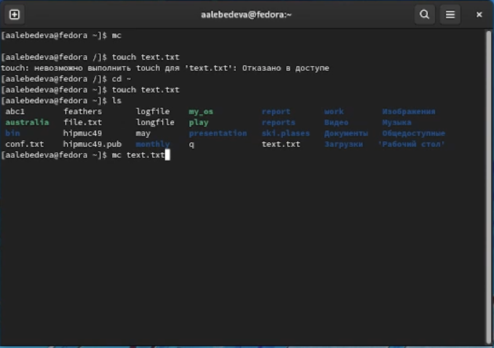
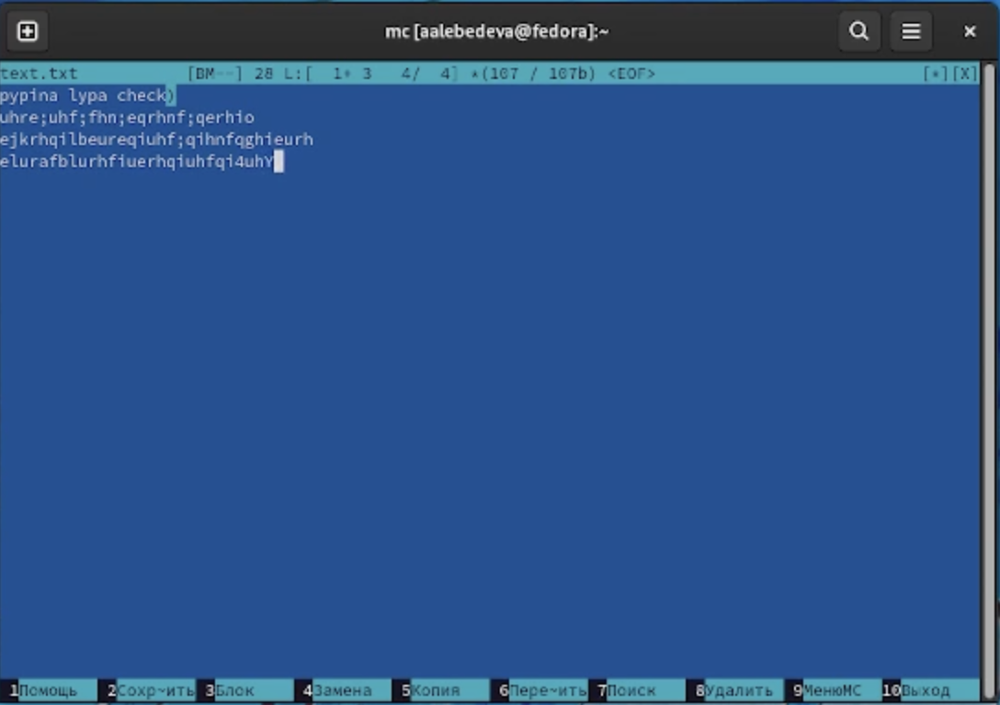

---
## Front matter
lang: ru-RU
title: "Отчёт по лабораторной работе №7"
author: "Лебедева Алёна Алексеевна"
institute: |
	"Российский Университет Дружбы Народов"
date: "7 мая 2022"

## Formatting
toc: false
slide_level: 2
theme: metropolis
header-includes: 
 - \metroset{progressbar=frametitle,sectionpage=progressbar,numbering=fraction}
 - '\makeatletter'
 - '\beamer@ignorenonframefalse'
 - '\makeatother'
aspectratio: 43
section-titles: true
---

# Цель работы

Освоение основных возможностей командной оболочки Midnight Commander.Приобретение навыков практической работы по просмотру каталогов и файлов; манипуляцийс ними

## 1

 Изучаю информацию о mc командой man
 (рис. [-@fig:001])

{ #fig:001 width=70% }

## 2

Запускаю из командной строки mc и изучаю его структуру и меню
(рис. [-@fig:002])

{ #fig:002 width=70% }

## 3

Выполняю несколько операций в mc, используя управляющие клавиши

## 4

Используя возможности подменю Файл, выполняю: 
- просмотр содержимого текстового файла 
- копирование файлов в созданный каталог
(рис. [-@fig:003])

{ #fig:003 width=70% }

## 5

С помощью соответствующих средств подменю Команда осуществляю: 
- поиск в файловой системе файла с заданными условиями
(рис. [-@fig:004])

{ #fig:004 width=70% }

## 6

Создаю текстовый файл text.txt
(рис. [-@fig:005])

{ #fig:005 width=70% }

## 7

Открываю данный файл с помощью mc редактора и вставляю в открытй файл небольшой фрагмент текста
(рис. [-@fig:006])

{ #fig:006 width=70% }

## 8

Проделываю с текстом некоторые манипуляции: 
-  удаляю строку текста 
- выделяю текст и вставляю в новую строку,сохраняю файл и отменяю последнее действие

## 9

выделяю текст и вставляю в новую строку,сохраняю файл и отменяю последнее действие

## 10

Пользуюсь меню редактора и включаю подсветку синтаксиса

# Вывод

В ходе выполнения лабораторной работы №7 я освоила основные возможности командной оболочки Midnight Commander, приобрела навыки практической работы по просмотру каталогов и файлов

## {.standout}

Спасибо за внимание!
