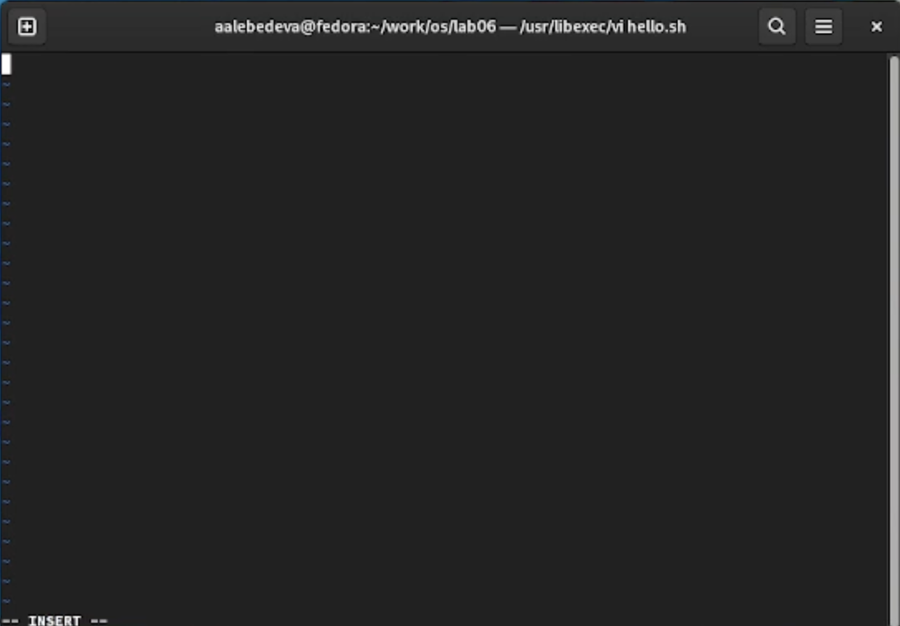
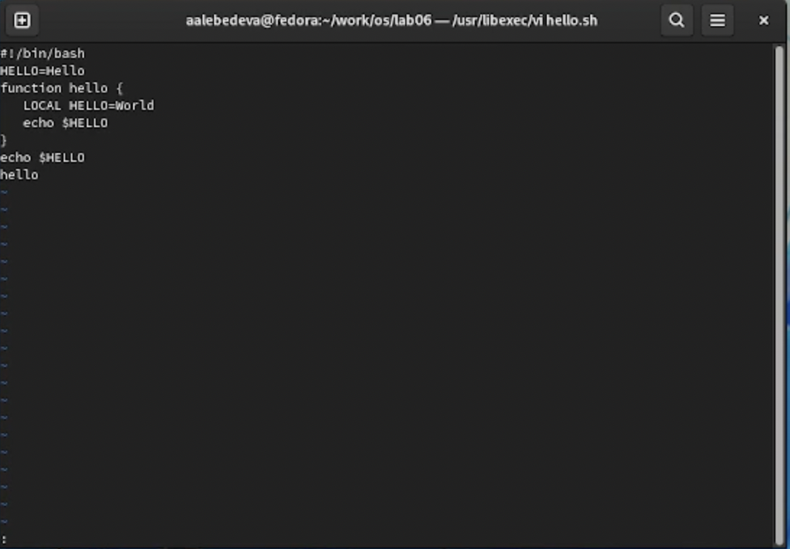
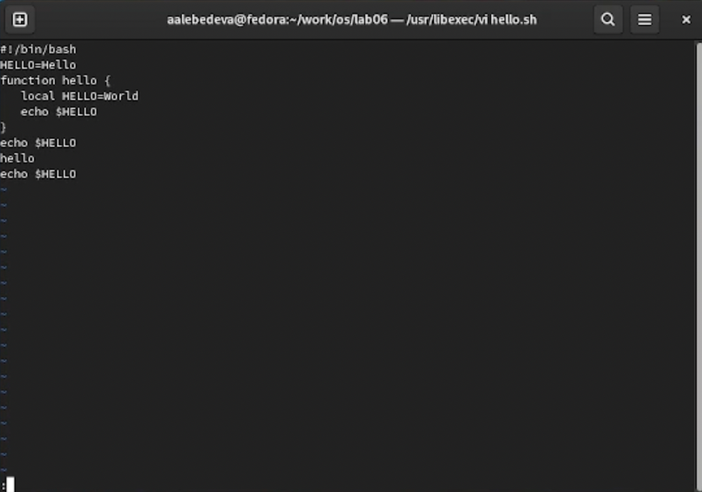

---
## Front matter
lang: ru-RU
title: "Отчёт по лабораторной работе №8"
author: "Лебедева Алёна Алексеевна"
institute: |
	"Российский Университет Дружбы Народов"
date: "7 мая 2022"

## Formatting
toc: false
slide_level: 2
theme: metropolis
header-includes: 
 - \metroset{progressbar=frametitle,sectionpage=progressbar,numbering=fraction}
 - '\makeatletter'
 - '\beamer@ignorenonframefalse'
 - '\makeatother'
aspectratio: 43
section-titles: true
---

# Цель работы

Познакомиться с операционной системой Linux. Получить практические навыки рабо- ты с редактором vi, установленным по умолчанию практически во всех дистрибутивах.

## 1

 Создаем в домашней папке каталог work/2020-2021/os-intro/laboratory/lab06. 2. Командой «cd ork/2020-2021/os-intro/laboratory/lab06» переходим в созданный каталог

## 2

Вызываем vi и создаем файл hello.sh с помощью команды «vi hello.sh
(рис. [-@fig:001])

{ #fig:001 width=70% }

## 3

Нажимаем клавишу «i» и вводим текст, указанный в лабораторной работе
(рис. [-@fig:002])

{ #fig:002 width=70% }

## 4

Нажимаем клавишу «Esc», чтобы перейти в командный режим после завершения ввода текста. Нажимаем «:» для перехода в режим последней строки и внизу экрана видим, что появилось приглашение в виде двоеточия. Нажимаем «w» (записать) и «q» (выйти), далее нажимаем клавишу «Enter» для сохранения текста и завершения работы

## 5

Чтобы сделать файл исполняемым, используем команду «chmod +x hello.sh»

## 6

Вызовем vi для редактирования файла с помощью команды «vi ~/work/2020-2021/os-intro/laboratory/lab09/hello.sh». Далее с помощью стрелок установила курсор в конец слова HELL второй строки. Перейдем в режим вставки, нажав на клавишу «i», и заменим HELL на HELLO, дописав O. Нажмем «Esc» для возврата в командный режим. С помощью стрелок установим курсор на четвертую строку и сотрем слово LOCAL с помощью комбинации клавиш «d» (delete) и «w» (word). Перейдем в режим вставки, нажав клавишу «i», и наберем следующий текст: local. Нажмем «Esc» для возврата в командный режим. Установим курсор на последней строке файла, используя стрелки. Вставим после неё строку, содержащую следующий текст: echo $HELLO 
(рис. [-@fig:003])

{ #fig:003 width=70% }

## 7

Далее нажимаем «Esc», чтобы перейти в командный режим. Удаляем последнюю строку, используя комбинацию клавиш «d» и «d». Введем команду отмены изменений «u» для отмены последней команды. Введем символ «:» для перехода в режим последней строки. Запишем произведённые изменения, нажав «w» и «q» и выйдем из vi

# Вывод

В ходе выполнения данной лабораторной работы я познакомился с операционной системой Linux и получил практические навыки работы с редактором vi.

## {.standout}

Спасибо за внимание!
