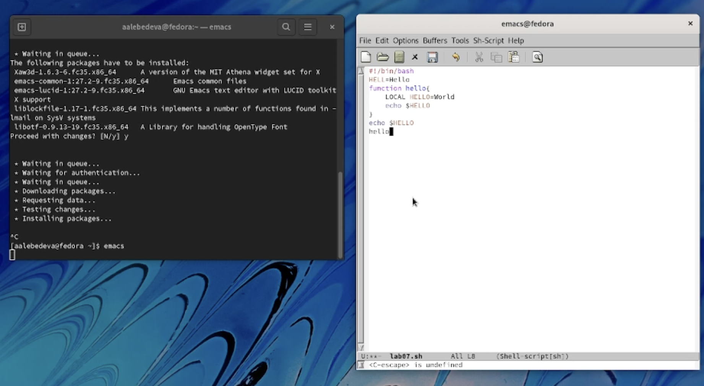
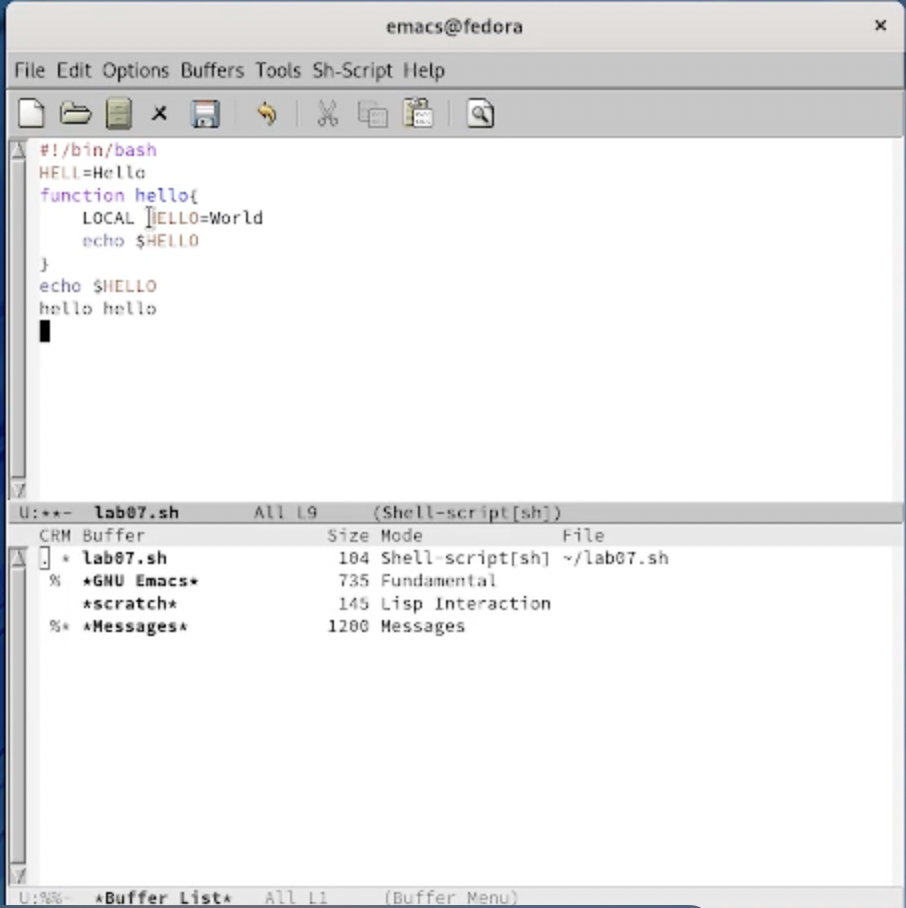
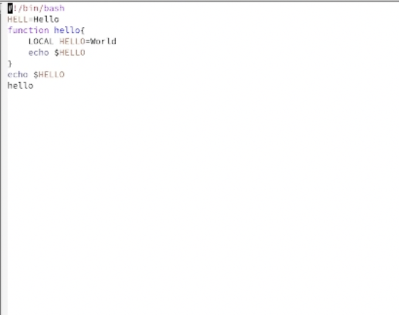
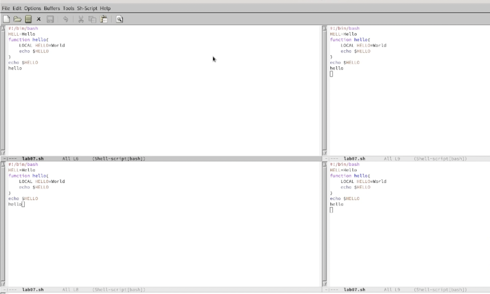
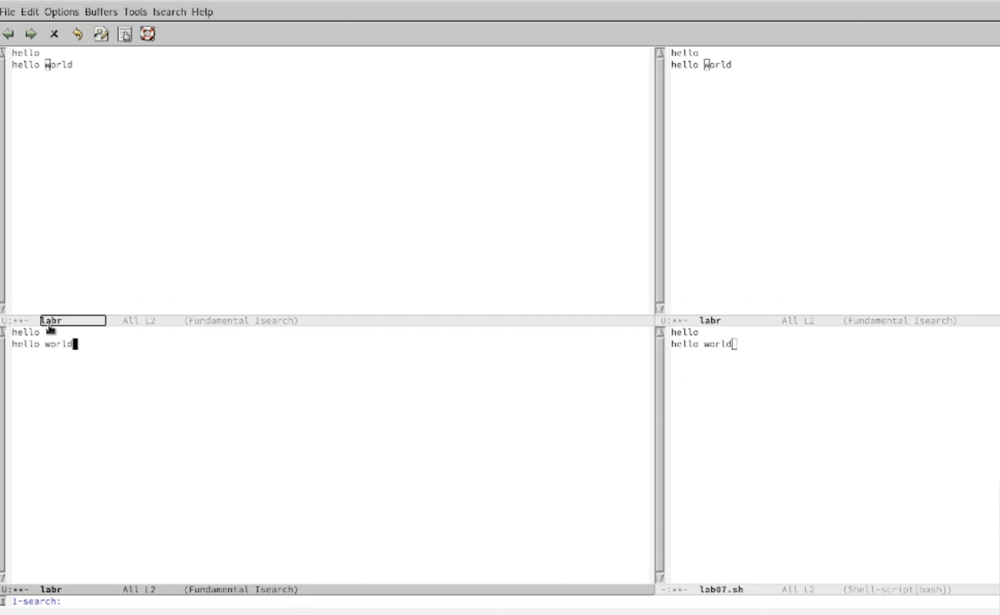

---
## Front matter
lang: ru-RU
title: "Отчёт по лабораторной работе №9"
author: "Лебедева Алёна Алексеевна"
institute: |
	"Российский Университет Дружбы Народов"
date: "20 мая 2022"

## Formatting
toc: false
slide_level: 2
theme: metropolis
header-includes: 
 - \metroset{progressbar=frametitle,sectionpage=progressbar,numbering=fraction}
 - '\makeatletter'
 - '\beamer@ignorenonframefalse'
 - '\makeatother'
aspectratio: 43
section-titles: true
---

# Цель работы

Познакомиться с операционной системой Linux.Получить практические навыки работы с редактором emacs

## 1

Открыть emacs. Создать файл lab07.sh с помощью комбинации Ctrl-x Ctrl-f (C-x C-f).
    Наберите текст:
- #!/bin/bash
- HELL=Hello
- function hello {
- LOCAL HELLO=World
- echo $HELLO
- }
- echo $HELLO
- hello

(рис. [-@fig:001])

{ #fig:001 width=70% }

## 2

Сохранил файл с помощью комбинации Ctrl-x Ctrl-s (C-x C-s).

##3

Проделал с текстом стандартные процедуры редактирования, каждое действие осуществлялось комбинацией клавиш.
- Вырезала одной командой целую строку (С-k).
- Вставила эту строку в конец файла (C-y).
- Выделила область текста (C-space).
- Скопировала область в буфер обмена (M-w).
- Вставила область в конец файла.
- Вновь выделила эту область и на этот раз вырезала её (C-w).
- Отменила последнее действие (C-/).

##4

4. Научилась использовать команды по перемещению курсора.
- Переместила курсор в начало строки (C-a)
- Переместила курсор в конец строки (C-e)

##5

Управление буферами
- Вывела список активных буферов на экран (C-x C-b).

(рис. [-@fig:002])

{ #fig:002 width=70% }

- Переместилась во вновь открытое окно (C-x) o со списком открытых буферов и переключился на другой буфер.
- Закрыла это окно (C-x 0)

(рис. [-@fig:003])

{ #fig:003 width=70% }

- Вновь переключилась между буферами, но без вывода их списка на экран (C-x b)

##6

Управление окнами.
- Поделила фрейм на 4 части: разделила фрейм на два окна по вертикали
(C-x 3), а затем каждое из этих окон на две части по горизонтали (C-x 2)

(рис. [-@fig:004])

{ #fig:004 width=70% }

- В каждом из четырёх созданных окон открыла новый буфер (файл) и ввел несколько строк текста

(рис. [-@fig:005])

{ #fig:004 width=70% }

##7

Режим поиска
- Переключилась в режим поиска (C-s) и нашла несколько слов, присутствующих в тексте.
- Переключалаья между результатами поиска, нажимая C-s.
- Вышла из режима поиска, нажав C-g.
- Перешла в режим поиска и замены (M-%), ввела текст, который следует найти и заменить, нажал Enter , затем ввела текст для замены. После того как были подсвечены результаты поиска, нажала ! для подтверждения замены.
- Испробовала другой режим поиска, нажав M-s o. Он отличается от обычного режима тем, что при поиске указывает номера строк в которых найдено введённое слово и выделяет их цветом. В обычном режиме выделение цветом появляется, только когда нужно подтвердить замену.

# Вывод

Познакомилаья с операционной системой Linux, получила практические навыки работы с редактором Emacs.
