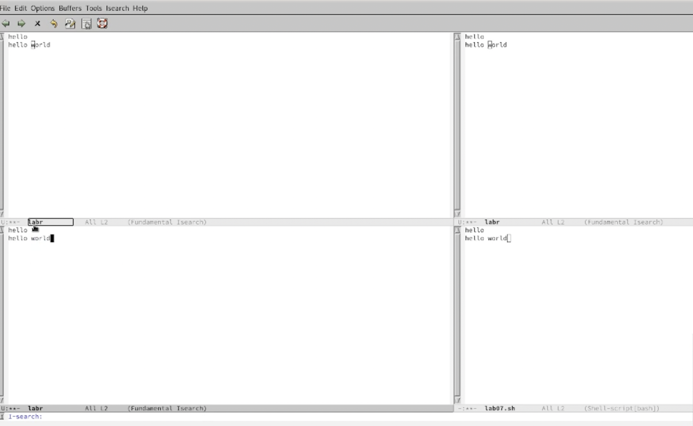

---
## Front matter
title: "Отчёт по лабораторной работе №9"
subtitle: "Дисциплина: операционные системы"
author: "Лебедева Алёна Алексеевна"

## Generic otions
lang: ru-RU
toc-title: "Содержание"

## Bibliography
bibliography: bib/cite.bib
csl: pandoc/csl/gost-r-7-0-5-2008-numeric.csl

## Pdf output format
toc: true # Table of contents
toc-depth: 2
lof: true # List of figures
lot: true # List of tables
fontsize: 12pt
linestretch: 1.5
papersize: a4
documentclass: scrreprt
## I18n polyglossia
polyglossia-lang:
  name: russian
  options:
	- spelling=modern
	- babelshorthands=true
polyglossia-otherlangs:
  name: english
## I18n babel
babel-lang: russian
babel-otherlangs: english
## Fonts
mainfont: PT Serif
romanfont: PT Serif
sansfont: PT Sans
monofont: PT Mono
mainfontoptions: Ligatures=TeX
romanfontoptions: Ligatures=TeX
sansfontoptions: Ligatures=TeX,Scale=MatchLowercase
monofontoptions: Scale=MatchLowercase,Scale=0.9
## Biblatex
biblatex: true
biblio-style: "gost-numeric"
biblatexoptions:
  - parentracker=true
  - backend=biber
  - hyperref=auto
  - language=auto
  - autolang=other*
  - citestyle=gost-numeric
## Pandoc-crossref LaTeX customization
figureTitle: "Рис."
tableTitle: "Таблица"
listingTitle: "Листинг"
lofTitle: "Список иллюстраций"
lotTitle: "Список таблиц"
lolTitle: "Листинги"
## Misc options
indent: true
header-includes:
  - \usepackage{indentfirst}
  - \usepackage{float} # keep figures where there are in the text
  - \floatplacement{figure}{H} # keep figures where there are in the text
---

# Цель работы

Познакомиться с операционной системой Linux.Получить практические навыки работы с редактором emacs

# Задание

1.    Открыть emacs.
2. Создать файл lab07.sh с помощью комбинации Ctrl-x Ctrl-f (C-x C-f).
3.    Наберите текст:
- #!/bin/bash
- HELL=Hello
- function hello {
- LOCAL HELLO=World
- echo $HELLO
- }
- echo $HELLO
- hello
4.    Сохранить файл с помощью комбинации Ctrl-x Ctrl-s (C-x C-s).
5.    Проделать с текстом стандартные процедуры редактирования,каждое действие долж- но осуществляться комбинацией клавиш.
5.1. Вырезать одной командой целую строку (С-k).
5.2. Вставить эту строку в конец файла (C-y).
5.3. Выделить областьтекста (C-space).
5.4. Скопировать область в буфер обмена (M-w).
5.5. Вставить область в конец файла.
5.6. Вновь выделить эту область и на этотраз вырезать её (C-w).
5.7. Отмените последнее действие (C-/).
6.    Научитесь использовать команды по перемещению курсора.
6.1. Переместите курсор в начало строки (C-a).
6.2. Переместите курсор в конец строки (C-e).
6.3. Переместите курсор в начало буфера (M-<).
6.4. Переместите курсор в конец буфера (M->).
7.    Управление буферами.
7.1. Вывести список активных буферов на экран (C-x C-b)
7.2. Переместитесь во вновь открытое окно (C-x) o со списком открытых буферов и переключитесь на другой буфер.
7.3. Закройте это окно (C-x 0).
7.4. Теперь вновь переключайтесь между буферами,но уже без вывода их списка на экран (C-x b).
8.    Управление окнами.
8.1. Поделите фрейм на 4 части: разделите фрейм на два окна по вертикали (C-x 3), а затем каждое из этих окон на две части по горизонтали (C-x 2)
8.2. В каждом из четырёх созданных окон откройте новый буфер (файл) и введите несколько строктекста.
9.    Режим поиска
9.1. Переключитесьв режим поиска (C-s) и найдите несколько слов,присутствующих втексте.
9.2. Переключайтесь между результатами поиска,нажимая C-s.
9.3. Выйдите из режима поиска,нажав C-g.
9.4. Перейдите в режим поиска и замены (M-%),введитетекст,который следует найти и заменить,нажмите Enter ,затем введитетекстдля замены.Послетого как будут подсвечены результаты поиска,нажмите ! для подтверждения замены.
9.5. Испробуйте другой режим поиска,нажав M-s o.Объясните,чем он отличается от обычного режима?

 

# Выполнение лабораторной работы

1. Открыла emacs. Создала файл lab07.sh с помощью комбинации Ctrl-x Ctrl-f (C-x C-f). Набрал текст:
1 #!/bin/bash
2 HELL=Hello
3 function hello {
4 LOCAL HELLO=World
5 echo $HELLO
6 }
7 echo $HELLO
8 hello
 (рис. [-@fig:001])

{ #fig:001 width=70% }

2. Сохранил файл с помощью комбинации Ctrl-x Ctrl-s (C-x C-s).

3. Проделал с текстом стандартные процедуры редактирования, каждое действие осуществлялось комбинацией клавиш.
- Вырезала одной командой целую строку (С-k).
- Вставила эту строку в конец файла (C-y).
- Выделила область текста (C-space).
- Скопировала область в буфер обмена (M-w).
- Вставила область в конец файла.
- Вновь выделила эту область и на этот раз вырезала её (C-w).
- Отменила последнее действие (C-/).

4. Научилась использовать команды по перемещению курсора.
- Переместила курсор в начало строки (C-a)
- Переместила курсор в конец строки (C-e)

5. Управление буферами
- Вывела список активных буферов на экран (C-x C-b).

(рис. [-@fig:002])

{ #fig:002 width=70% }

- Переместилась во вновь открытое окно (C-x) o со списком открытых буферов и переключился на другой буфер.
- Закрыла это окно (C-x 0)

(рис. [-@fig:003])

{ #fig:003 width=70% }

- Вновь переключилась между буферами, но без вывода их списка на экран (C-x b)

6. Управление окнами.
- Поделила фрейм на 4 части: разделила фрейм на два окна по вертикали
(C-x 3), а затем каждое из этих окон на две части по горизонтали (C-x 2)

(рис. [-@fig:004])

{ #fig:004 width=70% }

- В каждом из четырёх созданных окон открыла новый буфер (файл) и ввел несколько строк текста

(рис. [-@fig:005])

{ #fig:004 width=70% }

7. Режим поиска
- Переключилась в режим поиска (C-s) и нашла несколько слов, присутствующих в тексте.
- Переключалаья между результатами поиска, нажимая C-s.
- Вышла из режима поиска, нажав C-g.
- Перешла в режим поиска и замены (M-%), ввела текст, который следует найти и заменить, нажал Enter , затем ввела текст для замены. После того как были подсвечены результаты поиска, нажала ! для подтверждения замены.
- Испробовала другой режим поиска, нажав M-s o. Он отличается от обычного режима тем, что при поиске указывает номера строк в которых найдено введённое слово и выделяет их цветом. В обычном режиме выделение цветом появляется, только когда нужно подтвердить замену.

# Выводы

Познакомилаья с операционной системой Linux, получила практические навыки работы с редактором Emacs.

#Контрольные вопросы

1.    Emacs представляет собой мощный экранный редактор текста, написанный на языке высокого уровня Elisp.
2.    Развитие Emacs в сторону его многогранности послужило причиной того, что и без того интуитивно непонятная программа стала чрезвычайно сложной в применении. В частности, управление осуществляется при помощи различных клавиатурных комбинаций, запомнить которые будет непросто.
3.    Буфер – что-то, состоящее из текста. Окно – область с одним из буферов.
4.    В одном окне можно открыть больше 10 буферов.
5.    После запуска emacs без каких-либо параметров в основном окне отображается буфер scratch, который используется для оценки выражений Emacs Lisp, а также для заметок, которые вы не хотите сохранять. Этот буфер не сохраняется автоматически.
6.    Чтобы ввести следующую комбинацию C-c | я нажму клавиши: Control+c и Shift+, и для C-c C-|: Control+c и Control+Shift+.
7.    Поделить текущее окно на две части можно двумя комбинациями клавиш: C-x 3 или C-x 2.
8.    Настроить или расширить Emacs можно написав или изменив файл ~/.emacs.
9.    Клавиша > выполняет функцию перемещения курсора в открытом окне также, как и многие другие клавиши её можно переназначить.
10.   Редактор emacs показался мне удобнее из-за возможности открытия нескольких окон с буферами и работать комбинациями клавиш в этот редакторе мне было проще.

