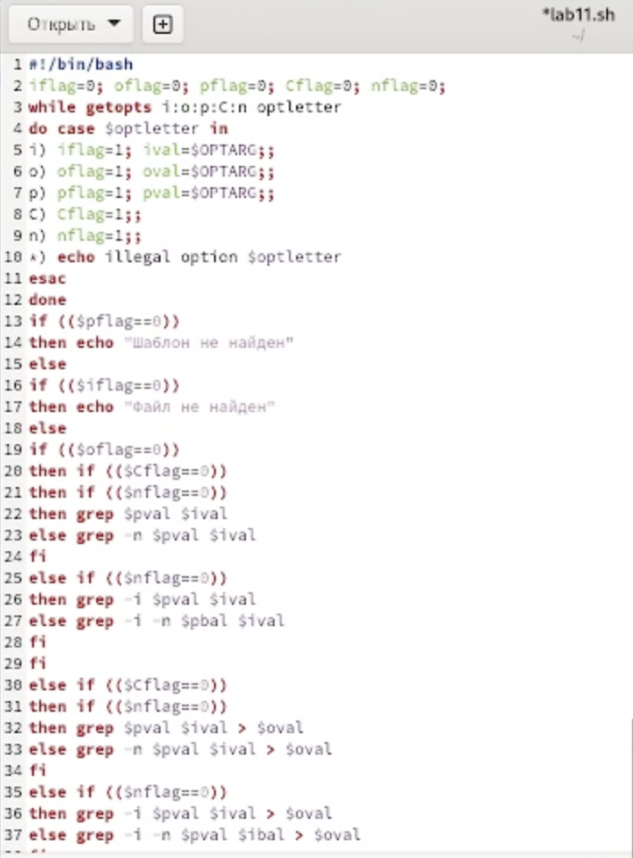
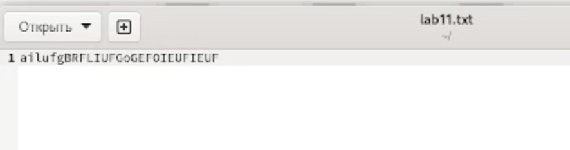
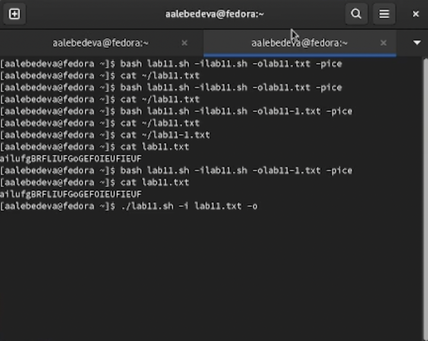
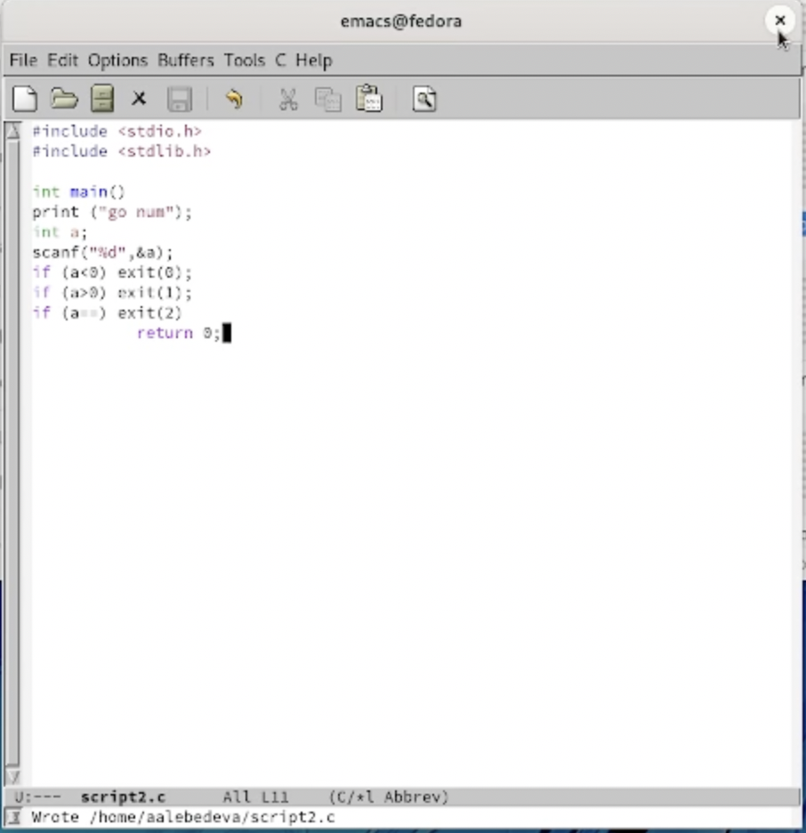
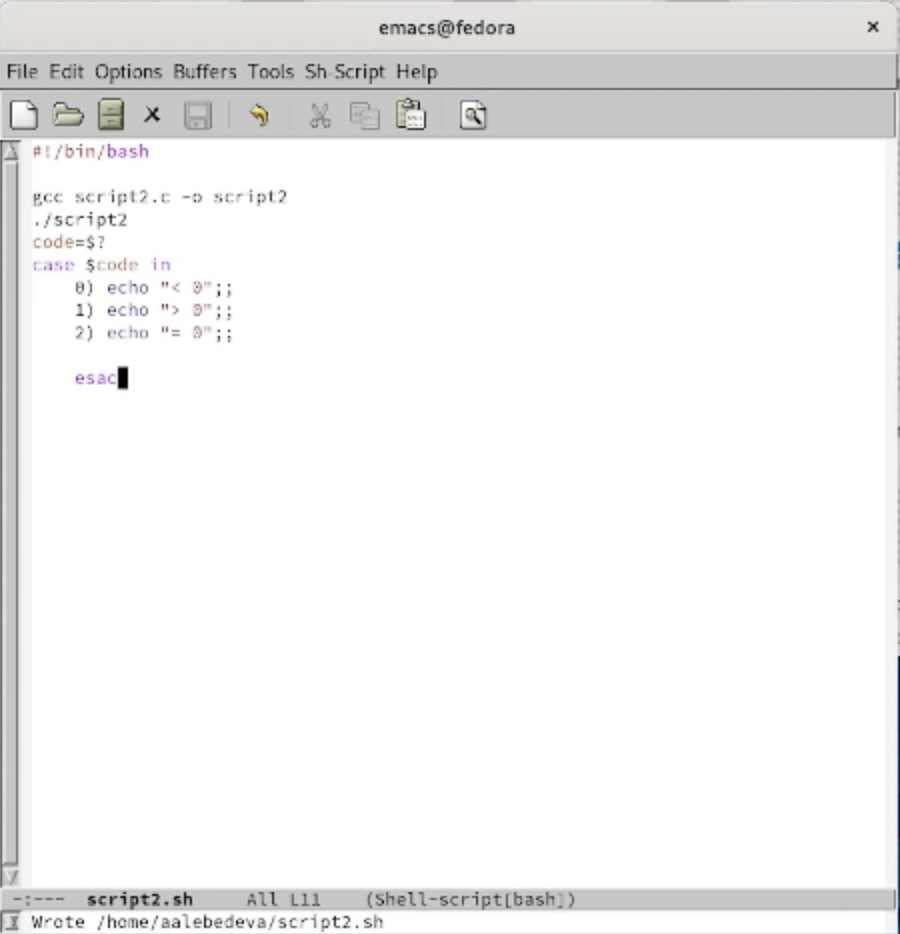
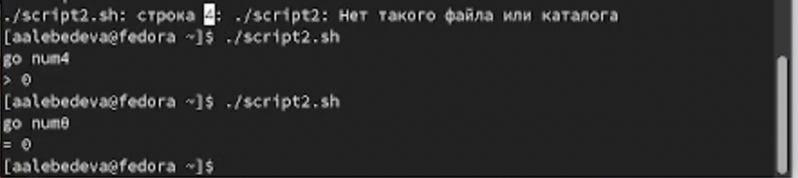
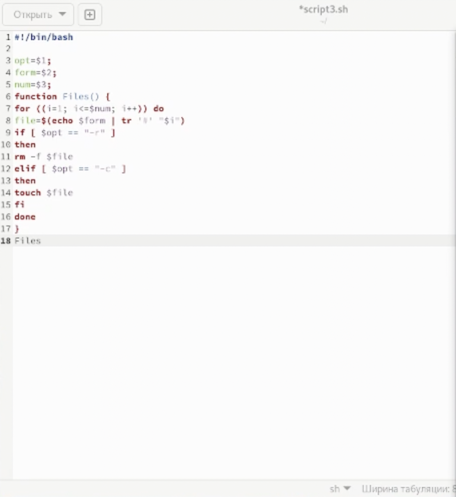
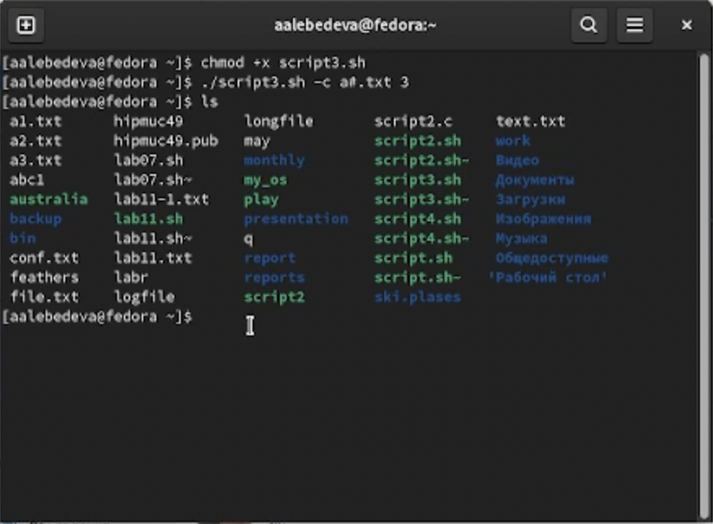

---
## Front matter
lang: ru-RU
title: "Отчёт по лабораторной работе №11"
author: "Лебедева Алёна Алексеевна"
institute: |
	"Российский Университет Дружбы Народов"
date: "25 мая 2022"

## Formatting
toc: false
slide_level: 2
theme: metropolis
header-includes: 
 - \metroset{progressbar=frametitle,sectionpage=progressbar,numbering=fraction}
 - '\makeatletter'
 - '\beamer@ignorenonframefalse'
 - '\makeatother'
aspectratio: 43
section-titles: true
---

# Цель работы

Изучить основы программирования в оболочке ОС UNIX. Научится писать более сложные командные файлы с использованием логических управляющих конструкций и циклов.

## 1

1. Используя команды getopts grep, написала командный файл, который анализирует командную строку с ключами: – -iinputfile — прочитать данные из указанного файла; – -ooutputfile — вывести данные в указанный файл; – -pшаблон — указать шаблон для поиска; – -C — различать большие и малые буквы; – -n — выдавать номера строк.

 (рис. [-@fig:001])

{ #fig:001 width=70% }

 (рис. [-@fig:002])

{ #fig:002 width=70% }

 (рис. [-@fig:003])

{ #fig:003 width=70% }

## 2

2. Написала на языке Си программу, которая вводит число и определяет, является ли оно больше нуля, меньше нуля или равно нулю. Затем программа завершается с помощью функции exit(n), передавая информацию в о коде завершения в оболочку. Командный файл должен вызывать эту программу и, проанализировав с помощью команды $?, выдать сообщение о том, какое число было введено.

   (рис. [-@fig:004])

{ #fig:004 width=70% }

 (рис. [-@fig:005])

{ #fig:005 width=70% }

 (рис. [-@fig:006])

{ #fig:006 width=70% }

## 3

Написала командный файл, создающий указанное число файлов, пронумерованных последовательно от 1 до N (например 1.tmp, 2.tmp, 3.tmp, 4.tmp и т.д.). Число файлов, которые необходимо создать, передаётся в аргументы командной строки. Этот же командный файл должен уметь удалять все созданные им файлы

 (рис. [-@fig:007])

{ #fig:007 width=70% }

 (рис. [-@fig:008])

{ #fig:008 width=70% }

# Вывод

В ходе выполнения лабораторной работы я изучила основы программирования в оболочке ОС UNIX. Научилась писать более сложные командные файлы с использованием логических управляющих конструкций и циклов.
