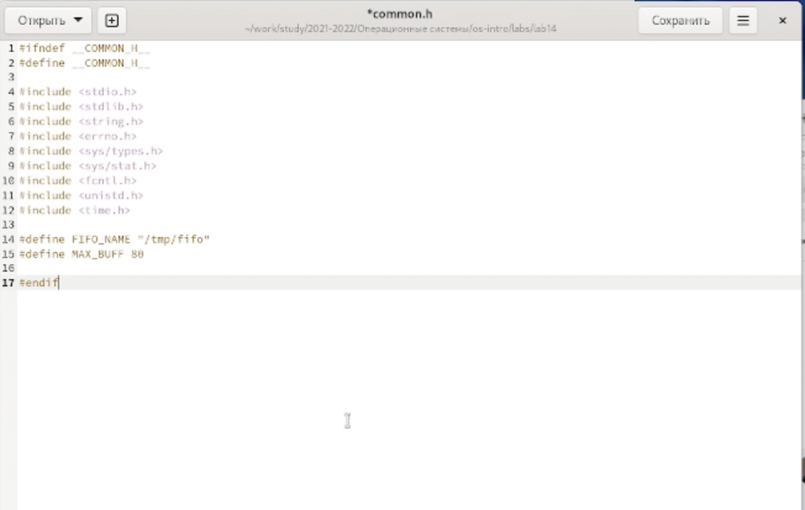
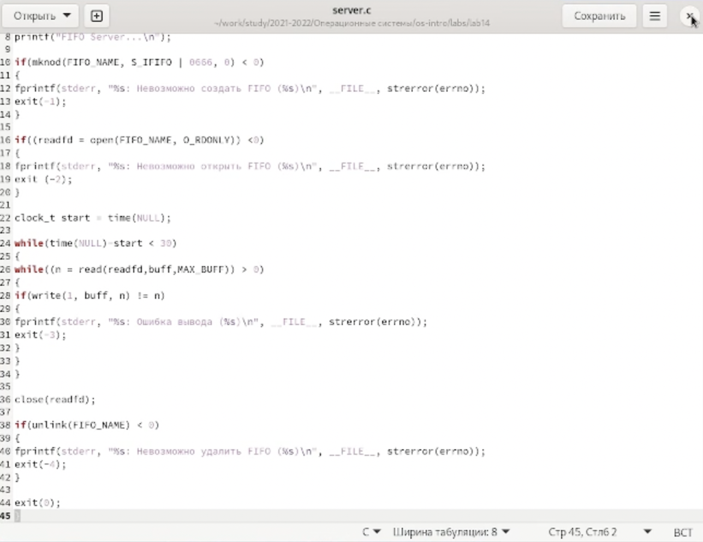
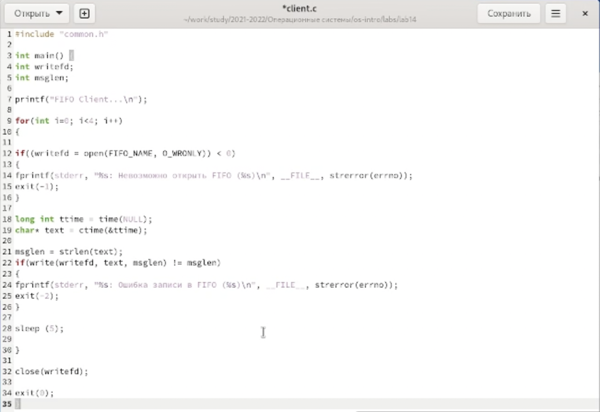
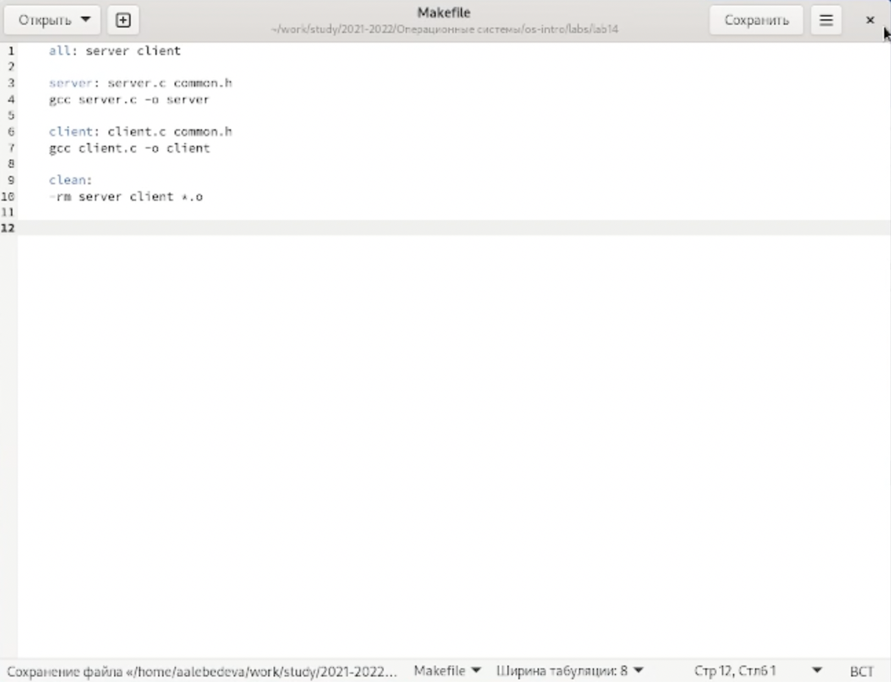
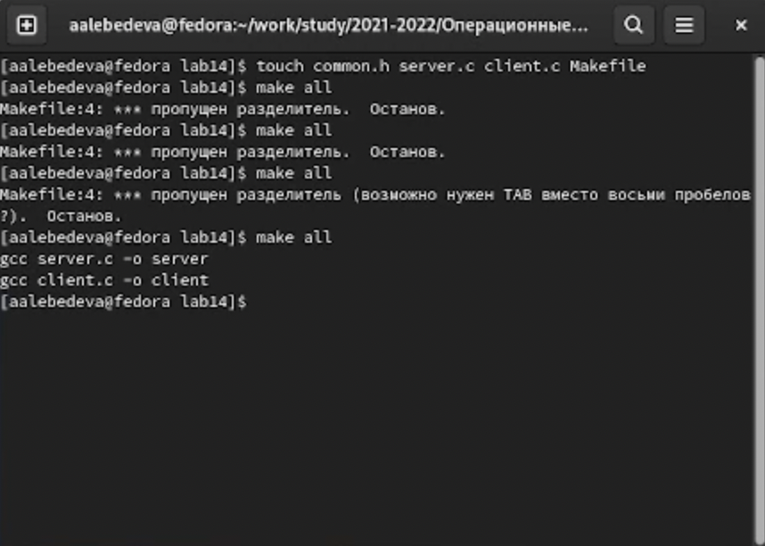
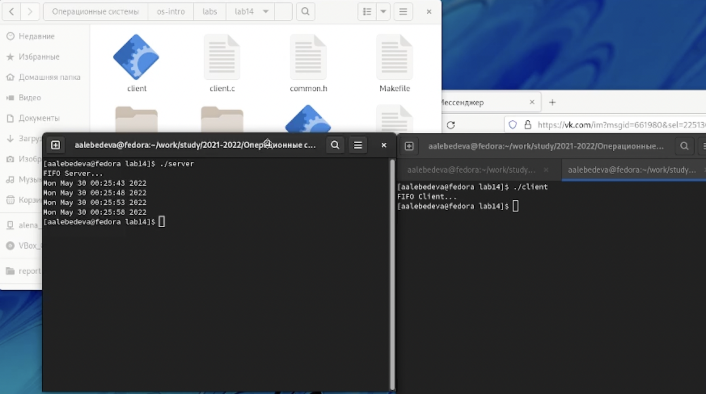

---
## Front matter
lang: ru-RU
title: "Отчёт по лабораторной работе №14"
author: "Лебедева Алёна Алексеевна"
institute: |
	"Российский Университет Дружбы Народов"
date: "25 мая 2022"

## Formatting
toc: false
slide_level: 2
theme: metropolis
header-includes: 
 - \metroset{progressbar=frametitle,sectionpage=progressbar,numbering=fraction}
 - '\makeatletter'
 - '\beamer@ignorenonframefalse'
 - '\makeatother'
aspectratio: 43
section-titles: true
---

# Цель работы

Приобретение практических навыков работы с именованными каналами.

## 1

Для начала я создалa необходимые файлы с помощью команды «touch common.h server.c client.c Makefile» и открылa редактор emacs для их редактирования.

## 2

Далее я изменилa коды программ, представленных в тексте лабораторной работы. В файл common.h добавилa стандартные заголовочные файлы unistd.h и time.h, необходимые для работы кодов других файлов. Common.h предназначен для заголовочных файлов, чтобы в остальных программах их не прописывать каждый раз

 (рис. [-@fig:001])

{ #fig:001 width=70% }

    В файл server.c добавилa цикл while для контроля за временем работы сервера. Разница между текущим временем time(NULL) и временем начала работы clock_t start=time(NULL) (инициализация до цикла) не должна превышать 30 секунд
    
     (рис. [-@fig:002])

{ #fig:002 width=70% }

    В файл client.c добавилa цикл, который отвечает за количество сообщений о текущем времени (4 сообщения), которое получается в результате выполнения команд, и команду sleep(5) для приостановки работы клиента на 5 секунд
    
     (рис. [-@fig:003])
     
{ #fig:003 width=70% }

    Makefile (файл для сборки) не изменялa
    
       (рис. [-@fig:004])

{ #fig:004 width=70% }
    

## 3

После написания кодов, я, используя команду «make all», скомпилировалa необходимые файлы

 (рис. [-@fig:005])

{ #fig:005 width=70% }

    Далее я проверила работу написанного кода. Отрыла 3 консоли (терминала) и запустила: в первом терминале − «./server», в остальных двух – «./client». В результате каждый терминал-клиент вывел по 4 сообщения. Спустя 30 секунд работа сервера была прекращена. Программа работает корректно.

 (рис. [-@fig:006])

{ #fig:006 width=70% }

# Вывод

В ходе выполнения данной лабораторной работы я приобрёл практические навыки работы с именованными каналами.

