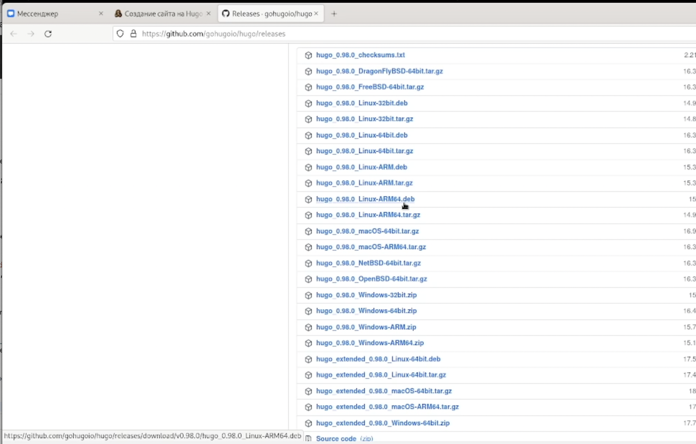
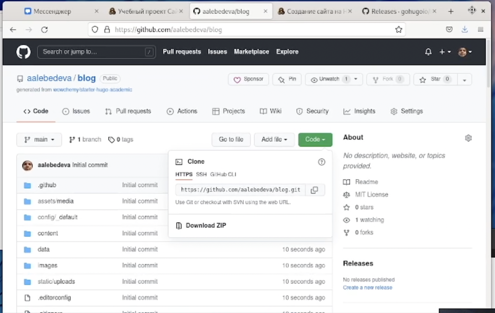
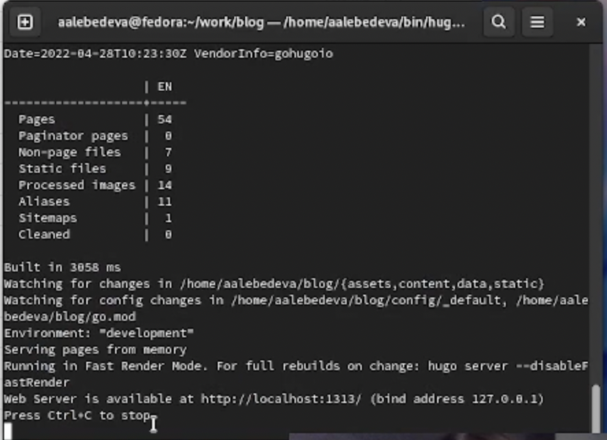
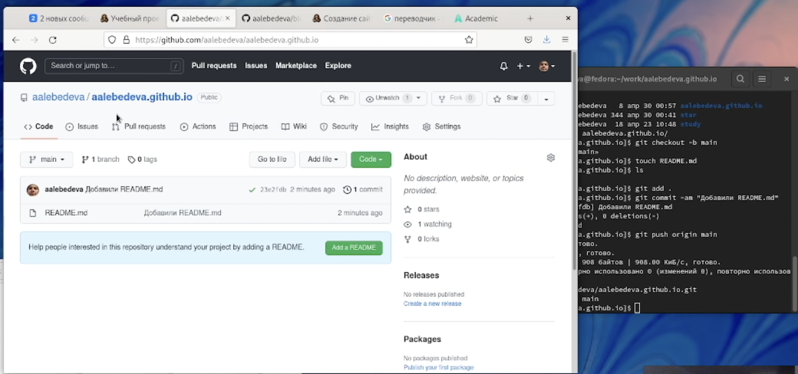
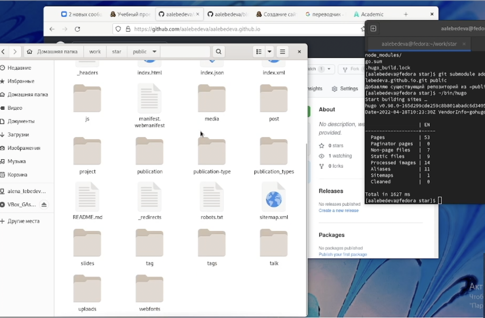

---
## Front matter
lang: ru-RU
title: "Отчёт по Индивидуальному пректу. Этап №1"
author: "Лебедева Алёна Алексеевна"
institute: |
	"Российский Университет Дружбы Народов"
date: "30 апреля 2022"

## Formatting
toc: false
slide_level: 2
theme: metropolis
header-includes: 
 - \metroset{progressbar=frametitle,sectionpage=progressbar,numbering=fraction}
 - '\makeatletter'
 - '\beamer@ignorenonframefalse'
 - '\makeatother'
aspectratio: 43
section-titles: true
---

# Цель работы

Создание собственного персонального сайта

## 1

Устанавливаю необходимое программное обеспечение на виртуальную машину
(рис. [-@fig:001])

{ #fig:001 width=70% }

## 2

Скачиваем шаблон темы сайта 
(рис. [-@fig:002])

{ #fig:002 width=70% }

## 3

Размещаем шаблон темы сайта в хостинге git
(рис. [-@fig:003])

{ #fig:003 width=70% }

## 4

Устанавливаем параметры для URLs сайта 
(рис. [-@fig:004])

{ #fig:004 width=70% }

## 5

Размещаем заготовку сайта на Github pages
(рис. [-@fig:005])

{ #fig:005 width=70% }

# Вывод

Я изучила первый этап создания персонального сайта, а именно размещение на Github pages заготовки для сайта

## {.standout}

Спасибо за внимание!
