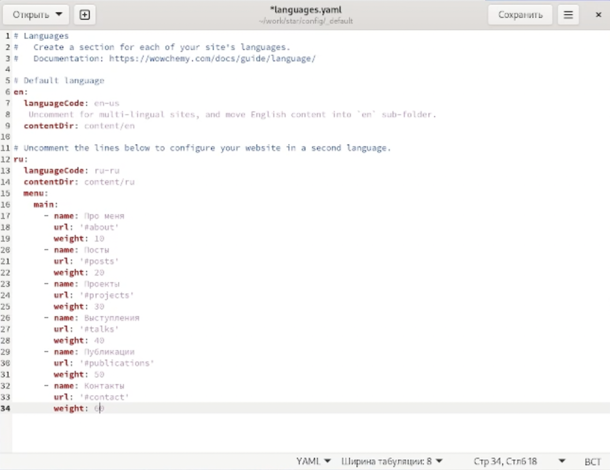
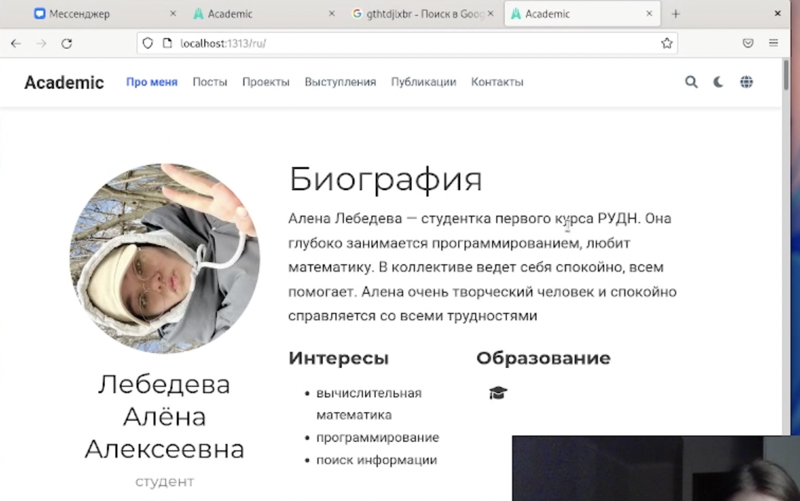
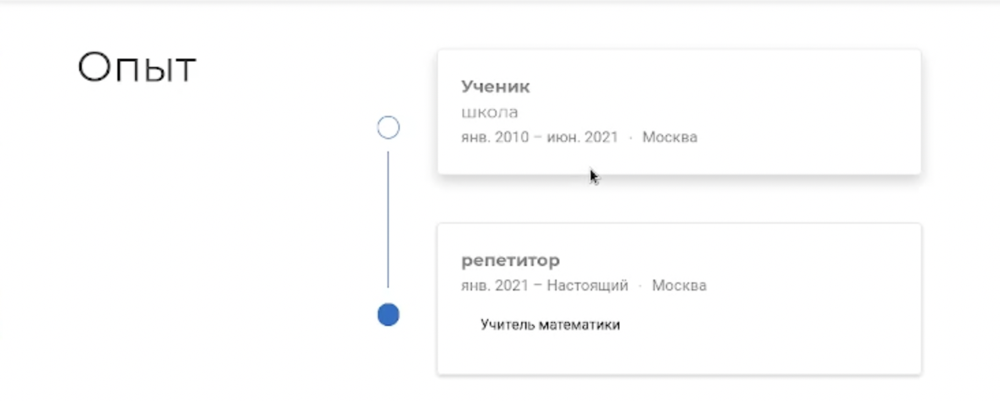
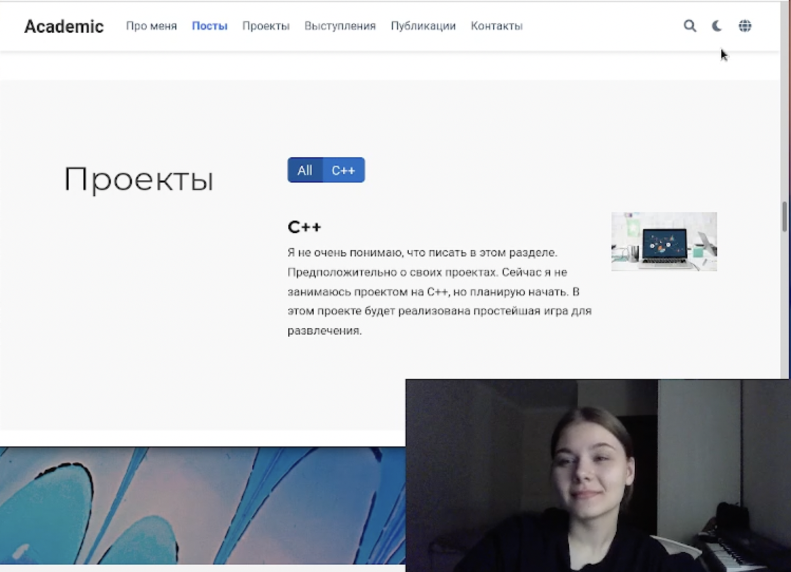

---
## Front matter
lang: ru-RU
title: "Отчёт по Индивидуальному пректу. Этап №6"
author: "Лебедева Алёна Алексеевна"
institute: |
	"Российский Университет Дружбы Народов"
date: "21 may 2022"

## Formatting
toc: false
slide_level: 2
theme: metropolis
header-includes: 
 - \metroset{progressbar=frametitle,sectionpage=progressbar,numbering=fraction}
 - '\makeatletter'
 - '\beamer@ignorenonframefalse'
 - '\makeatother'
aspectratio: 43
section-titles: true
---

# Цель работы

Создание собственного персонального сайта

## 1

 Сделать поддержку английского и рксского языка на сайте, путём изменения некоторых файлов

 (рис. [-@fig:001])

{ #fig:001 width=70% }

## 2

Проверяю внесённые изменения на сайте
(рис. [-@fig:002])

{ #fig:002 width=70% }

(рис. [-@fig:003])

{ #fig:003 width=70% }

(рис. [-@fig:004])

{ #fig:004 width=70% }

## 3

Пишу и добавляю пост по выбору и пост о прошлой неделе

## 4

Загружаю все на гит

# Вывод

Я научилась делать поддержку для сайта на английском и русском языке  

## {.standout}

Спасибо за внимание!
